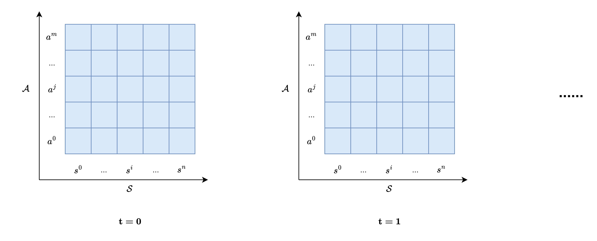
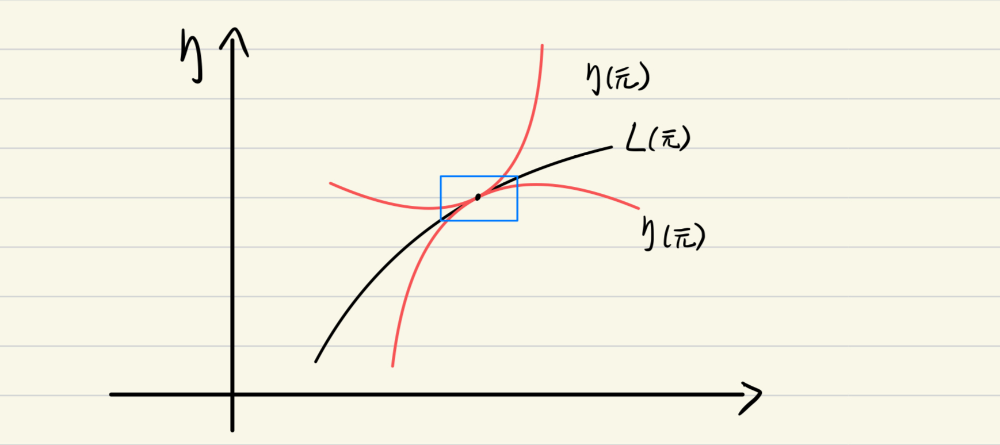

---

---

## TRPO算法数学证明

### $\eta(\tilde{\pi}) - \eta(\pi) = \mathbb{E}_{\tau_{\tilde{\pi}}}\left[\sum\limits_{t=0}^{\infty} \gamma^t A_{\pi}(s_t, a_t)\right]$ 证明

**策略 $\pi$ 下的轨迹 $\tau_{\pi}$ 定义**
$$\tau_{\pi} = (s_0, a_0, r_0, s_1, a_1, r_1, \ldots)$$

**策略 $\pi$ 下的轨迹回报 $J(\tau_{\pi})$ 定义**
$$J(\tau_{\pi}) = \sum_{t=0}^{\infty} \gamma^t r_t$$

**策略 $\pi$ 下的轨迹期望回报 $\eta(\pi)$ 定义**
$$\eta(\pi) = \mathbb{E}[J(\tau_{\pi})] = \mathbb{E}_{\tau_{\pi}}\left[\sum_{t=0}^{\infty} \gamma^t r_t\right]$$

**$\eta(\pi)$ 与 $V_{\pi}$ 的关系**

设状态空间为 $\mathcal{S} = \{s^{1}, s^{2}, \ldots, s^{n}\}$，$t$ 时刻的状态 $s^{i}$ 定义为 $s_t^{i}$，$t=0$ 时刻的状态 $s_0$ 概率分布为 $d(s)$，则 $\eta(\pi)$ 可以表示为
$$\eta(\pi) = \sum_{i=1}^{n} d(s_{0}^{i}) V_{\pi}(s_{0}^{i})=\mathbb{E}_{s_0 \sim d}[V_{\pi}(s_0)]$$

**新策略 $\tilde{\pi}$ 下 $V_{\pi}(s_0)$ 的期望 $\mathbb{E}_{\tau_{\tilde{\pi}}}\left[V_{\pi}(s_0)\right]$**

在 $t=0$ 时刻，新旧策略下的状态 $s_0$ 的概率分布相同，均为 $d(s)$，因此
$$
\begin{equation}
\mathbb{E}_{\tau_{\tilde{\pi}}}\left[V_{\pi}(s_0)\right]=\mathbb{E}_{s_0 \sim d}[V_{\pi}(s_0)]
\end{equation}
$$

**新策略下 $\eta(\tilde{\pi})$ 与旧策略下 $\eta(\pi)$ 的差值**
$$
\begin{align}
\eta(\tilde{\pi}) - \eta(\pi) &= \mathbb{E}_{\tau_{\tilde{\pi}}}\left[\sum_{t=0}^{\infty} \gamma^t r_t\right] - \mathbb{E}_{\tau_{\pi}}\left[\sum_{t=0}^{\infty} \gamma^t r_t\right] \\
&= \mathbb{E}_{\tau_{\tilde{\pi}}}\left[\sum_{t=0}^{\infty} \gamma^t r_t\right] - \mathbb{E}_{s_0 \sim d}[V_{\pi}(s_0)] \\
&= \mathbb{E}_{\tau_{\tilde{\pi}}}\left[\sum_{t=0}^{\infty} \gamma^t (r_t + V_{\pi}(s_{t+1}) - V_{\pi}(s_{t+1}))\right] - \mathbb{E}_{s_0 \sim d}[V_{\pi}(s_0)] \\
&= \mathbb{E}_{\tau_{\tilde{\pi}}}\left[\sum_{t=0}^{\infty} \gamma^t Q_{\pi}(s_t, a_t)\right] - \mathbb{E}_{\tau_{\tilde{\pi}}}\left[\sum_{t=0}^{\infty} \gamma^t V_{\pi}(s_{t+1})\right] - \mathbb{E}_{\tau_{\tilde{\pi}}}\left[V_{\pi}(s_0)\right] \\
&= \mathbb{E}_{\tau_{\tilde{\pi}}}\left[\sum_{t=0}^{\infty} \gamma^t Q_{\pi}(s_t, a_t)\right] - \mathbb{E}_{\tau_{\tilde{\pi}}}\left[\sum_{t=0}^{\infty} \gamma^t V_{\pi}(s_{t})\right] \\
&= \mathbb{E}_{\tau_{\tilde{\pi}}}\left[\sum_{t=0}^{\infty} \gamma^t (Q_{\pi}(s_t, a_t) - V_{\pi}(s_{t}))\right] \\
&= \mathbb{E}_{\tau_{\tilde{\pi}}}\left[\sum_{t=0}^{\infty} \gamma^t A_{\pi}(s_t, a_t)\right]
\end{align}
$$
- (4)~(5) 变换含义: 使用新策略的奖励 $r_{t}$ 和旧策略的状态价值函数 $V_{\pi}(s_{t})$ 来计算新策略的动作价值 $Q_{\pi}(s_t, a_t)$
- (5)~(6): 由 (1) 推导
- (7) 含义: **新策略的动作价值与旧策略的状态价值之差即为新旧策略期望回报的差值**
- (8) 含义: **使用新策略相对于旧策略的优势函数来计算新策略相对于旧策略的改进**

### $\mathbb{E}_{\tau_{\tilde{\pi}}}\left[\sum\limits_{t=0}^{\infty} \gamma^t A_{\pi}(s_t, a_t)\right] = \sum\limits_{s \in \mathcal{S}} \rho_{\tilde{\pi}}(s) \sum\limits_{a \in \mathcal{A}} \tilde{\pi}(a|s) A_{\pi}(s, a)$ 证明

**状态空间 $\mathcal{S}$ 和动作空间 $\mathcal{A}$ 定义**
$$\mathcal{S} = \{s^{1}, s^{2}, \ldots, s^{n}\}$$
$$\mathcal{A} = \{a^{1}, a^{2}, \ldots, a^{m}\}$$

**新策略 $\tilde{\pi}$ 下的状态分布 $\rho_{\tilde{\pi}}(s^{i})$ 定义**

$$\rho_{\tilde{\pi}}(s^{i}) = \sum_{t=0}^{\infty} \gamma^t P(s_{t} = s^{i} | \tilde{\pi})$$

$$
\begin{equation}
\begin{aligned}
\sum_{s^{i} \in \mathcal{S}} \rho_{\tilde{\pi}}(s^{i}) &= \sum_{s^{i} \in \mathcal{S}} \sum_{t=0}^{\infty} \gamma^t P(s_{t} = s^{i} | \tilde{\pi}) \\
&= \sum_{t=0}^{\infty} \gamma^t \sum_{s^{i} \in \mathcal{S}} P(s_{t} = s^{i} | \tilde{\pi}) \\
&= \sum_{t=0}^{\infty} \gamma^t \cdot 1 \\
&= \frac{1}{1-\gamma}
\end{aligned}
\end{equation}
$$

- 含义: 新策略 $\tilde{\pi}$ 下状态 $s^{i}$ 在空间 $\mathcal{T} = (\mathbb{N}, \le), \mathcal{S} \times \mathcal{A} \times \mathcal{T}$ 中的折扣占用测度

**$\mathbb{E}_{\tau_{\tilde{\pi}}}\left[\sum\limits_{t=0}^{\infty} \gamma^t A_{\pi}(s_t, a_t)\right]$ 展开**
$$
\begin{equation}
\begin{aligned}
\mathbb{E}_{\tau_{\tilde{\pi}}}\left[\sum\limits_{t=0}^{\infty} \gamma^t A_{\pi}(s_t, a_t)\right] &= \sum_{t=0}^{\infty} \gamma^t \mathbb{E}_{\tau_{\tilde{\pi}}}\left[A_{\pi}(s_t, a_t)\right] \\
&= \sum_{t=0}^{\infty} \gamma^t \sum_{s^{i} \in \mathcal{S}} P(s_t = s^{i} | \tilde{\pi}) \sum_{a^{j} \in \mathcal{A}} P(a_t = a^{j} | s_t = s^{i}, \tilde{\pi}) A_{\pi}(s^{i}, a^{j}) \\
&= \sum_{t=0}^{\infty} \gamma^t \sum_{s^{i} \in \mathcal{S}} P(s_t = s^{i} | \tilde{\pi}) \sum_{a^{j} \in \mathcal{A}} \tilde{\pi}(a^{j}|s^{i}) A_{\pi}(s^{i}, a^{j}) \\
&= \sum_{s^{i} \in \mathcal{S}} \left( \sum_{t=0}^{\infty} \gamma^t P(s_t = s^{i} | \tilde{\pi}) \right) \sum_{a^{j} \in \mathcal{A}} \tilde{\pi}(a^{j}|s^{i}) A_{\pi}(s^{i}, a^{j}) \\
&= \sum_{s^{i} \in \mathcal{S}} \rho_{\tilde{\pi}}(s^{i}) \sum_{a^{j} \in \mathcal{A}} \tilde{\pi}(a^{j}|s^{i}) A_{\pi}(s^{i}, a^{j}) \\
&= \sum_{s \in \mathcal{S}} \rho_{\tilde{\pi}}(s) \sum_{a \in \mathcal{A}} \tilde{\pi}(a|s) A_{\pi}(s, a)
\end{aligned}
\end{equation}
$$

### $L_{\pi}(\tilde{\pi})$ 定义

**由 (8) 和 (10) 可推**
$$
\eta(\tilde{\pi}) - \eta(\pi) = \sum_{s \in \mathcal{S}} \rho_{\tilde{\pi}}(s) \sum_{a \in \mathcal{A}} \tilde{\pi}(a|s) A_{\pi}(s, a)
$$

$$
\begin{equation}
\eta(\tilde{\pi}) = \eta(\pi) + \sum_{s \in \mathcal{S}} \rho_{\tilde{\pi}}(s) \sum_{a \in \mathcal{A}} \tilde{\pi}(a|s) A_{\pi}(s, a)
\end{equation}
$$

**定义 $L_{\pi}(\tilde{\pi})$**
$$
\begin{equation}
L_{\pi}(\tilde{\pi}) = \eta(\pi) + \sum_{s \in \mathcal{S}} \rho_{\pi}(s) \sum_{a \in \mathcal{A}} \tilde{\pi}(a|s) A_{\pi}(s, a)
\end{equation}
$$

**证明在旧策略 $\pi$ 处优化 $L_{\pi}(\tilde{\pi})$ 等同于优化 $\eta(\tilde{\pi})$**

- (11) 和 (12) 在 $\tilde{\pi} = \pi$ 处相等

- (12) 在 $\tilde{\pi} = \pi$ 处的梯度
$$
\begin{equation}
\begin{aligned}
\nabla_{\tilde{\pi}} L_{\pi}(\tilde{\pi}) |_{\tilde{\pi} = \pi} &= \nabla_{\tilde{\pi}} \left( \eta(\pi) + \sum_{s \in \mathcal{S}} \rho_{\pi}(s) \sum_{a \in \mathcal{A}} \tilde{\pi}(a|s) A_{\pi}(s, a) \right) |_{\tilde{\pi} = \pi} \\
&= \nabla_{\tilde{\pi}} \left( \sum_{s \in \mathcal{S}} \rho_{\pi}(s) \sum_{a \in \mathcal{A}} \tilde{\pi}(a|s) A_{\pi}(s, a) \right) |_{\tilde{\pi} = \pi} \\
&= \sum_{s \in \mathcal{S}} \nabla_{\tilde{\pi}} \left( \rho_{\pi}(s) \sum_{a \in \mathcal{A}} \tilde{\pi}(a|s) A_{\pi}(s, a) \right) |_{\tilde{\pi} = \pi} \\
&= \sum_{s \in \mathcal{S}} \sum_{a \in \mathcal{A}} A_{\pi}(s, a) \rho_{\pi}(s) \nabla_{\tilde{\pi}} \tilde{\pi}(a|s) |_{\tilde{\pi} = \pi}
\end{aligned}
\end{equation}
$$

- (11) 在 $\tilde{\pi} = \pi$ 处的梯度
$$
\begin{equation}
\begin{aligned}
\nabla_{\tilde{\pi}} \eta(\tilde{\pi}) |_{\tilde{\pi} = \pi} &= \nabla_{\tilde{\pi}} \left( \eta(\pi) + \sum_{s \in \mathcal{S}} \rho_{\tilde{\pi}}(s) \sum_{a \in \mathcal{A}} \tilde{\pi}(a|s) A_{\pi}(s, a) \right) |_{\tilde{\pi} = \pi} \\
&= \nabla_{\tilde{\pi}} \left( \sum_{s \in \mathcal{S}} \rho_{\tilde{\pi}}(s) \sum_{a \in \mathcal{A}} \tilde{\pi}(a|s) A_{\pi}(s, a) \right) |_{\tilde{\pi} = \pi} \\
&= \sum_{s \in \mathcal{S}} \nabla_{\tilde{\pi}} \left( \rho_{\tilde{\pi}}(s) \sum_{a \in \mathcal{A}} \tilde{\pi}(a|s) A_{\pi}(s, a) \right) |_{\tilde{\pi} = \pi} \\
&= \sum_{s \in \mathcal{S}} \sum_{a \in \mathcal{A}} A_{\pi}(s, a) \nabla_{\tilde{\pi}} \big( \rho_{\tilde{\pi}}(s) \tilde{\pi}(a|s) \big) |_{\tilde{\pi} = \pi} \\
&= \sum_{s \in \mathcal{S}} \sum_{a \in \mathcal{A}} A_{\pi}(s, a) \big( \nabla_{\tilde{\pi}} \rho_{\tilde{\pi}}(s) * \tilde{\pi}(a|s) + \rho_{\tilde{\pi}}(s) * \nabla_{\tilde{\pi}} \tilde{\pi}(a|s) \big) |_{\tilde{\pi} = \pi}, 由 (13) 可推导 \\
&= \sum_{s \in \mathcal{S}} \sum_{a \in \mathcal{A}} A_{\pi}(s, a) \big( \nabla_{\tilde{\pi}} \rho_{\tilde{\pi}}(s) * \tilde{\pi}(a|s) \big) |_{\tilde{\pi} = \pi} + \nabla_{\tilde{\pi}} L_{\pi}(\tilde{\pi}) |_{\tilde{\pi} = \pi}
\end{aligned}
\end{equation}
$$

$$
\begin{equation}
\begin{aligned}
\sum_{s \in \mathcal{S}} \sum_{a \in \mathcal{A}} A_{\pi}(s, a) \big( \nabla_{\tilde{\pi}} \rho_{\tilde{\pi}}(s) * \tilde{\pi}(a|s) \big) |_{\tilde{\pi} = \pi} &= \sum_{s \in \mathcal{S}} \nabla_{\tilde{\pi}} \rho_{\tilde{\pi}}(s) |_{\tilde{\pi} = \pi} \sum_{a \in \mathcal{A}} A_{\pi}(s, a) * \tilde{\pi}(a|s) |_{\tilde{\pi} = \pi} \\
&= \sum_{s \in \mathcal{S}} \nabla_{\tilde{\pi}} \rho_{\tilde{\pi}}(s) |_{\tilde{\pi} = \pi} \sum_{a \in \mathcal{A}} A_{\pi}(s, a) * \pi(a|s), 由优势函数定义可知 \\
&= \sum_{s \in \mathcal{S}} \nabla_{\tilde{\pi}} \rho_{\tilde{\pi}}(s) |_{\tilde{\pi} = \pi} * 0 \\
&= 0
\end{aligned}
\end{equation}
$$

因此
$$
\begin{equation}
\nabla_{\tilde{\pi}} \eta(\tilde{\pi}) |_{\tilde{\pi} = \pi} = \nabla_{\tilde{\pi}} L_{\pi}(\tilde{\pi}) |_{\tilde{\pi} = \pi}
\end{equation}
$$

**$L_{\pi}(\tilde{\pi})$ 与 $\eta(\tilde{\pi})$ 在 $\tilde{\pi} = \pi$ 处相等且在 $\tilde{\pi} = \pi$ 处的梯度相等，因此在旧策略 $\pi$ 处的一定邻域内优化 $L_{\pi}(\tilde{\pi})$ 等同于优化 $\eta(\tilde{\pi})$，于是优化目标从 $\eta(\tilde{\pi})$ 转换为 $L_{\pi}(\tilde{\pi})$**

### $|\eta(\tilde{\pi}) - L_{\pi}(\tilde{\pi})| \le \frac{4 \alpha^{2} \gamma \epsilon}{(1 - \gamma)^2}$ 证明

[点击此处查看详细证明](https://www.bilibili.com/video/BV16KESzTE7t/?share_source=copy_web&vd_source=72da718ce275d958d5a560bc4dd90630&t=273)

- $\gamma$: 折扣因子 $\gamma \in (0, 1)$
- $\alpha$: 新旧策略的最大距离 $\alpha = \max_{s} D_{TV}(\tilde{\pi}(\cdot|s), \pi(\cdot|s))$
- $\epsilon$: 旧策略下优势函数的最大值 $\epsilon = \max_{s} |\sum_{a} \tilde{\pi}(a|s) A_{\pi}(s, a)|$

$$
\begin{equation}
\begin{aligned}
|\eta(\tilde{\pi}) - L_{\pi}(\tilde{\pi})| \le \frac{4 \alpha^{2} \gamma \epsilon}{(1 - \gamma)^2} \\
\Rightarrow \eta(\tilde{\pi}) \ge L_{\pi}(\tilde{\pi}) - \frac{4 \alpha^{2} \gamma \epsilon}{(1 - \gamma)^2} \\
C = \frac{4 \gamma \epsilon}{(1 - \gamma)^2}, \quad \alpha = \max_{s} D_{TV}(\tilde{\pi}(\cdot|s), \pi(\cdot|s)) \\
\Rightarrow \eta(\tilde{\pi}) \ge L_{\pi}(\tilde{\pi}) - C \cdot \max_{s} D_{TV}(\tilde{\pi}(\cdot|s), \pi(\cdot|s))^2 \\
\end{aligned}
\end{equation}
$$

$$
\begin{equation}
\begin{aligned}
Pinsker 不等式: D_{TV}(P, Q) \le \sqrt{\frac{1}{2} D_{KL}(P || Q)} \\
\Rightarrow \max_{s} D_{TV}(\tilde{\pi}(\cdot|s), \pi(\cdot|s))^2 \le \frac{1}{2} \max_{s} D_{KL}(\tilde{\pi}(\cdot|s) || \pi(\cdot|s))
\end{aligned}
\end{equation}
$$

将 (18) 代入 (17)，可得
$$
\begin{equation}
\begin{aligned}
\eta(\tilde{\pi}) \ge L_{\pi}(\tilde{\pi}) - \frac{C}{2} \cdot \max_{s} D_{KL}(\tilde{\pi}(\cdot|s) || \pi(\cdot|s))
\end{aligned}
\end{equation}
$$

观察 $\frac{C}{2} \cdot \max_{s} D_{KL}(\tilde{\pi}(\cdot|s) || \pi(\cdot|s))$ 可知，其中的 $C$ 是一个常数，整体是一个惩罚项，于是将优化目标转换为如下形式
$$
\begin{equation}
\begin{aligned}
\max_{\tilde{\pi}} L_{\pi}(\tilde{\pi}), \quad \max_{s} D_{KL}(\tilde{\pi}(\cdot|s) || \pi(\cdot|s)) \le \delta
\end{aligned}
\end{equation}
$$
其中 $\delta$ 是一个超参数，表示新旧策略的最大KL散度

由于 $\max_{s} D_{KL}$ 计算复杂，因此 TRPO 算法将其转换为 $\mathbb{E}_{s \sim \rho_{\pi}}[D_{KL}(\tilde{\pi}(\cdot|s) || \pi(\cdot|s))]$[查看详情](https://www.bilibili.com/video/BV1g6jpzGEq6/?share_source=copy_web&vd_source=72da718ce275d958d5a560bc4dd90630&t=413)，优化目标如下
$$
\begin{equation}
\begin{aligned}
\max_{\tilde{\pi}} L_{\pi}(\tilde{\pi}), \quad \mathbb{E}_{s \sim \rho_{\pi}}[D_{KL}(\tilde{\pi}(\cdot|s) || \pi(\cdot|s))] \le \delta
\end{aligned}
\end{equation}
$$

### $L_{\pi}(\tilde{\pi})$ 的进一步转换

$$
L_{\pi}(\tilde{\pi}) = \eta(\pi) + \sum_{s \in \mathcal{S}} \rho_{\pi}(s) \sum_{a \in \mathcal{A}} \tilde{\pi}(a|s) A_{\pi}(s, a)
$$

将 $\sum_{s \in \mathcal{S}} \rho_{\pi}(s) \sum_{a \in \mathcal{A}} \tilde{\pi}(a|s) A_{\pi}(s, a)$ 转换为期望的形式
$$
\begin{equation}
\begin{aligned}
\sum_{s \in \mathcal{S}} \rho_{\pi}(s) \sum_{a \in \mathcal{A}} \tilde{\pi}(a|s) A_{\pi}(s, a) &=(\sum_{s \in \mathcal{S}} \rho_{\pi}(s)) * \sum_{s \in \mathcal{S}} \frac{\rho_{\pi}(s)}{\sum_{s \in \mathcal{S}} \rho_{\pi}(s)} \sum_{a \in \mathcal{A}} \tilde{\pi}(a|s) A_{\pi}(s, a), 由 (9) 可知 \\
&= \frac{1}{1-\gamma} \mathbb{E}_{s \sim \rho_{\pi}}\left[\sum_{a \in \mathcal{A}} \tilde{\pi}(a|s) A_{\pi}(s, a)\right] \\
&= \frac{1}{1-\gamma} \mathbb{E}_{s \sim \rho_{\pi}}\left[\sum_{a \in \mathcal{A}} \frac{\tilde{\pi}(a|s)}{\pi(a|s)} \pi(a|s) A_{\pi}(s, a)\right], 由重要性采样可知(在旧策略中采样动作) \\
&= \frac{1}{1-\gamma} \mathbb{E}_{s \sim \rho_{\pi}, a \sim \pi}\left[\frac{\tilde{\pi}(a|s)}{\pi(a|s)} A_{\pi}(s, a)\right]
\end{aligned}
\end{equation}
$$

因此
$$
\begin{equation}
L_{\pi}(\tilde{\pi}) = \eta(\pi) + \frac{1}{1-\gamma} \mathbb{E}_{s \sim \rho_{\pi}, a \sim \pi}\left[\frac{\tilde{\pi}(a|s)}{\pi(a|s)} A_{\pi}(s, a)\right]
\end{equation}
$$

由 (21) 和 (23) 可得 TRPO 算法的优化目标如下
$$
\begin{aligned}
\max_{\tilde{\pi}} \eta(\pi) + \frac{1}{1-\gamma} \mathbb{E}_{s \sim \rho_{\pi}, a \sim \pi}\left[\frac{\tilde{\pi}(a|s)}{\pi(a|s)} A_{\pi}(s, a)\right], \quad \mathbb{E}_{s \sim \rho_{\pi}}[D_{KL}(\tilde{\pi}(\cdot|s) || \pi(\cdot|s))] \le \delta
\end{aligned}
$$

上式中 $\eta(\pi)$ 与 $A_{\pi}(s, a)$ 中的 $V_{\pi}(s)$((7)~(8)) 与 $\tilde{\pi}$ 无关，因此优化目标等价于
$$
\begin{equation}
\begin{aligned}
\max_{\tilde{\pi}} \mathbb{E}_{s \sim \rho_{\pi}, a \sim \pi}\left[\frac{\tilde{\pi}(a|s)}{\pi(a|s)} Q_{\pi}(s, a)\right] \\
\mathbb{E}_{s \sim \rho_{\pi}}[D_{KL}(\tilde{\pi}(\cdot|s) || \pi(\cdot|s))] \le \delta
\end{aligned}
\end{equation}
$$

### 优化目标的进一步转换

设 $\theta$ 和 $\theta_{old}$ 分别为新旧策略的参数，则优化目标如下

$$
\begin{equation}
\begin{aligned}
\max_{\theta} \quad & \mathbb{E}_{s \sim \rho_{\theta_{old}}, a \sim \pi_{\theta_{old}}} \left[ \frac{\pi_{\theta}(a|s)}{\pi_{\theta_{old}}(a|s)} Q_{\theta_{old}}(s, a) \right] \\
\text{s.t.} \quad & \mathbb{E}_{s \sim \rho_{\theta_{old}}} \left[ D_{KL}(\pi_{\theta_{old}}(\cdot|s) \| \pi_{\theta}(\cdot|s)) \right] \le \delta
\end{aligned}
\end{equation}
$$

设 $l(\theta) = \mathbb{E}_{s \sim \rho_{\theta_{old}}, a \sim \pi_{\theta_{old}}} \left[ \frac{\pi_{\theta}(a|s)}{\pi_{\theta_{old}}(a|s)} A_{\theta_{old}}(s, a) \right]$，$kl(\theta) = \mathbb{E}_{s \sim \rho_{\theta_{old}}} \left[ D_{KL}(\pi_{\theta_{old}}(\cdot|s) \| \pi_{\theta}(\cdot|s)) \right]$，则优化目标如下
$$
\begin{equation}
\begin{aligned}
\max_{\theta} \quad & l(\theta) \quad \text{s.t.} \quad kl(\theta) \le \delta
\end{aligned}
\end{equation}
$$

取 $l(\theta)$ 在 $\theta = \theta_{old}$ 处的一阶泰勒展开
$$
\begin{equation}
\begin{aligned}
l(\theta) &\approx l(\theta_{old}) + (\theta - \theta_{old})^T g_{l} \\
&= l(\theta_{old}) + \nabla_{\theta}^{T} g_{l}
\end{aligned}
\end{equation}
$$

取 $kl(\theta)$ 在 $\theta = \theta_{old}$ 处的二阶泰勒展开

$kl(\theta)$ 在 $\theta = \theta_{old}$ 处取到全局最小值 $0$，因此在 $\theta = \theta_{old}$ 处的一阶导数为 $0$，因此 $kl(\theta)$ 在 $\theta = \theta_{old}$ 处的二阶泰勒展开如下
$$
\begin{equation}
\begin{aligned}
kl(\theta) &\approx kl(\theta_{old}) + (\theta - \theta_{old})^T g_{kl} + \frac{1}{2} (\theta - \theta_{old})^T H_{kl} (\theta - \theta_{old}) \\
&= \frac{1}{2} (\theta - \theta_{old})^T H_{kl} (\theta - \theta_{old}) \\
&= \frac{1}{2} \nabla_{\theta}^{T} H_{kl} \nabla_{\theta}
\end{aligned}
\end{equation}
$$

由于 $l(\theta_{old})$ 与 $\theta$ 无关，因此优化目标如下
$$
\begin{equation}
\begin{aligned}
\max_{\theta} \nabla_{\theta}^{T} g_{l} \quad \text{s.t.} \quad \frac{1}{2} \nabla_{\theta}^{T} H_{kl} \nabla_{\theta} \le \delta
\end{aligned}
\end{equation}
$$

### KKT条件求解优化目标

设 $f(\theta) = \nabla_{\theta}^{T} g_{l}$，$g(\theta) = \frac{1}{2} \nabla_{\theta}^{T} H_{kl} \nabla_{\theta} - \delta$，则优化目标如下
$$
\begin{equation}
\begin{aligned}
\max_{\theta} \quad & f(\theta) \quad \text{s.t.} \quad g(\theta) \le 0
\end{aligned}
\end{equation}
$$

设拉格朗日乘子为 $\lambda$，则拉格朗日函数如下
$$
\begin{equation}
\begin{aligned}
\mathcal{L}(\theta, \lambda) = f(\theta) - \lambda g(\theta) = \nabla_{\theta}^{T} g_{l} - \lambda \left( \frac{1}{2} \nabla_{\theta}^{T} H_{kl} \nabla_{\theta} - \delta \right)
\end{aligned}
\end{equation}
$$

$$
\begin{equation}
\begin{aligned}
\nabla_{\theta} \mathcal{L}(\theta, \lambda) &= g_{l} - \lambda H_{kl} \nabla_{\theta}
\end{aligned}
\end{equation}
$$

由 $\nabla_{\theta} \mathcal{L}(\theta, \lambda) = 0$ 可得
$$
\begin{equation}
\begin{aligned}
g_{l} = \lambda H_{kl} \nabla_{\theta} \\
\Rightarrow \nabla_{\theta} = \frac{1}{\lambda} H_{kl}^{-1} g_{l}
\end{aligned}
\end{equation}
$$

**于是得到 $\theta_{old}$ 的优化方向为 $\frac{1}{\lambda} H_{kl}^{-1} g_{l}$，约束条件为 $\frac{1}{2} \nabla_{\theta}^{T} H_{kl} \nabla_{\theta} \le \delta$**

### 基于共轭梯度法(conjugate gradient)的优化求解

#### 使用共轭梯度法的数学动机
之所以能使用共轭梯度法来求解，是由 $H_{kl}$ 的数学性质决定的：
* **对称正定性**：$H_{kl}$ 在此处等价于 Fisher 信息矩阵（FIM），它是一个对称正定（或半正定）矩阵。
* **等价转化**：对于对称正定矩阵 $A$，解线性方程组 $Ax = b$ 等价于求解二次型函数 $f(x) = \frac{1}{2} x^{T} A x - b^{T} x$ 的全局最小值点(这个性质需要正定来保证)。
* **计算效率**：CG 可以在不显式求逆矩阵 $H_{kl}^{-1}$ 的情况下，通过迭代逼近最优解。

#### 共轭梯度法的迭代过程
令 $A = H_{kl}$，$b = g_{l}$，我们寻找向量 $x \approx H_{kl}^{-1} g_{l}$。其具体迭代步骤如下：
1. **初始化**：令初始估计 $x_{0} = 0$，初始残差 $r_{0} = H_{kl} x_{0} - g_{l} = -g_{l}$，初始共轭方向 $p_{0} = -r_{0} = g_{l}$。
2. **循环迭代**（通常 $k < 20$）：
$$
\begin{equation}
\begin{aligned}
\alpha_{k} &= \frac{r_{k}^{T} r_{k}}{p_{k}^{T} H_{kl} p_{k}} \\
x_{k+1} &= x_{k} + \alpha_{k} p_{k} \\
r_{k+1} &= r_{k} - \alpha_{k} H_{kl} p_{k} \\
\beta_{k} &= \frac{r_{k+1}^{T} r_{k+1}}{r_{k}^{T} r_{k}} \\
p_{k+1} &= -r_{k+1} + \beta_{k} p_{k}
\end{aligned}
\end{equation}
$$

#### Hessian-Vector Product (HVP) 技巧
在上述迭代中，计算 $\alpha_{k}$ 和 $r_{k+1}$ 时涉及矩阵-向量乘积 $H_{kl} p_{k}$。TRPO 利用自动微分技巧，避免了显式构造巨大的 $H_{kl}$ 矩阵，而是将其转化为两次一阶梯度运算：
$$
\begin{equation}
H_{kl} p_{k} \approx \nabla_{\theta} \left( \nabla_{\theta} D_{KL}(\pi_{\theta_{old}} \| \pi_{\theta})^T p_{k} \right) \Big|_{\theta = \theta_{old}}
\end{equation}
$$

### 最大步长计算与回溯线性搜索

在得到共轭梯度解 $x \approx H_{kl}^{-1} g_{l}$ 后，需要确定在该方向上能走多远，并确保更新后的策略满足原始的非线性约束。

#### 计算最大步长 (Maximum Step Length)
为了满足约束 $\frac{1}{2} \Delta \theta^T H_{kl} \Delta \theta \le \delta$，我们令更新量 $\Delta \theta = \beta x$。将此代入约束等式中：
$$
\begin{equation}
\frac{1}{2} (\beta x)^T H_{kl} (\beta x) = \delta \Rightarrow \frac{1}{2} \beta^2 (x^T H_{kl} x) = \delta
\end{equation}
$$
解得最大缩放因子 $\beta$：
$$
\begin{equation}
\beta = \sqrt{\frac{2\delta}{x^T H_{kl} x}}
\end{equation}
$$
于是，最大的参数建议更新量为 $\Delta \theta_{max} = \beta x$。

#### 回溯线性搜索 (Backtracking Line Search)
由于 $H_{kl}$ 和梯度 $g_l$ 仅仅是 $\theta_{old}$ 处的局部一阶和二阶近似，直接应用 $\Delta \theta_{max}$ 可能无法满足原始的非线性约束 $D_{KL}(\pi_{\theta_{old}} \| \pi_{\theta_{new}}) \le \delta$，或者导致目标函数 $L(\theta)$ 并没有真正增加。

为此，我们引入衰减系数 $\alpha \in (0, 1)$（通常取 $0.5$ 或 $0.8$），通过迭代寻找满足条件的步长。对于 $j = 0, 1, 2, \dots$：
1. **生成候选参数**：$\theta_{try} = \theta_{old} + \alpha^j \Delta \theta_{max}$。
2. **检查约束条件**：
   * **目标改进**：$L(\theta_{try}) > L(\theta_{old})$
   * **约束满足**：$D_{KL}(\pi_{\theta_{old}} \| \pi_{\theta_{try}}) \le \delta$
3. **判定**：如果上述两个条件同时满足，则停止搜索，令 $\theta_{new} = \theta_{try}$。如果迭代多次仍未找到合适步长，则放弃本次更新，保持 $\theta_{new} = \theta_{old}$。

#### 完整算法逻辑流

总结 TRPO 的完整单步更新逻辑：
1. **采样**：利用旧策略 $\pi_{\theta_{old}}$ 采集轨迹，计算优势函数 $A_{\pi}$。
2. **构建设想**：计算代理目标梯度 $g_l$ 和 KL 散度的 Hessian 向量乘积算子 $H_{kl}$。
3. **求解方向**：通过 **CG** 算法解 $H_{kl} x = g_l$。
4. **定标**：计算最大步长 $\beta$ 得到满步更新量 $\Delta \theta_{max}$。
5. **探测**：通过 **Line Search** 寻找既能提升目标又能严守 KL 约束的步长，完成更新。

## TRPO 算法代码示例