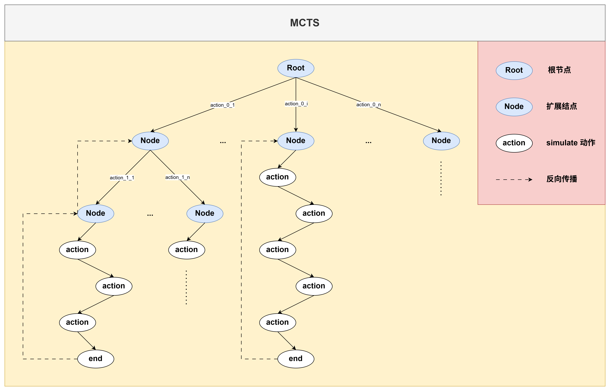

## 蒙特卡洛树搜索（MCTS）

蒙特卡洛树搜索（Monte Carlo Tree Search, MCTS）是一种用于决策过程的算法，适用于具有巨大状态空间的游戏和问题。MCTS 通过随机模拟来评估决策树中的节点，从而指导搜索过程

MCTS 的核心步骤包括：
- **选择（Selection）**：从根节点开始，根据某种策略(如 UCB)选择一个子节点，直到达到一个未完全展开的节点(存在未执行的动作)
- **扩展（Expansion）**：如果选择的节点不是终止节点且存在未执行的动作，则扩展该节点，添加一/多个子节点(随机选择一/多个未执行的动作创建新节点)
- **模拟（Simulation）**：从新扩展的节点开始，进行随机模拟，直到达到一个终止状态
- **回传（Backpropagation）**：将模拟的结果回传到路径上的所有节点，更新它们的统计信息



Game Interface:
``` python
class Game:
    def __init__(self):
        self.last_player = None
        self.current_player = 1
        self.map_size = (3, 3)
        self.board = [[0] * self.map_size[1] for _ in range(self.map_size[0])]
    
    def check_win(self, player):
        for i in range(self.map_size[0]):
            if all(self.board[i][j] == player for j in range(self.map_size[1])): return True
        for j in range(self.map_size[1]):
            if all(self.board[i][j] == player for i in range(self.map_size[0])): return True
        if all(self.board[i][i] == player for i in range(self.map_size[0])): return True
        if all(self.board[i][self.map_size[1] - 1 - i] == player for i in range(self.map_size[0])): return True
        return False

    def get_possible_moves(self):
        return [(i, j) for i in range(self.map_size[0]) for j in range(self.map_size[1]) if self.board[i][j] == 0]

    def apply_move(self, move):
        i, j = move
        self.board[i][j] = self.current_player
        self.last_player = self.current_player
        self.current_player = 3 - self.current_player
        return self.check_win(self.last_player)

    def clone(self):
        new_game = Game()
        new_game.board = [row[:] for row in self.board]
        new_game.current_player = self.current_player
        new_game.last_player = self.last_player
        return new_game

    def simulate(self):
        temp_game = self.clone()
        while True:
            moves = temp_game.get_possible_moves()
            if not moves: return 0
            move = random.choice(moves)
            if temp_game.apply_move(move): return temp_game.last_player

```

MCTS Data Structure:
``` python
class MCTSNode:
    def __init__(self, game, parent=None, move=None):
        self.game = game
        self.parent = parent
        self.move = move
        self.untried_moves = game.get_possible_moves()
        self.children = []
        self.visits = 0
        self.value = 0.0

    def is_fully_expanded(self):
        return len(self.untried_moves) == 0
    
    def best_child(self, c_param=1.4):
        choices = []
        for child in self.children:
            # UCB formula
            score = child.value / child.visits + c_param * math.sqrt(2 * math.log(self.visits) / child.visits)
            choices.append((score, child))
        return max(choices, key=lambda x: x[0])[1]

    def expand(self):
        move = random.choice(self.untried_moves)
        self.untried_moves.remove(move)
        new_game = self.game.clone()
        new_game.apply_move(move)
        child = MCTSNode(new_game, parent=self, move=move)
        self.children.append(child)
        return child
    
    def update(self, result):
        self.visits += 1
        if result == 0: self.value += 0.5
        elif result == self.game.last_player: self.value += 1.0
        if self.parent: self.parent.update(result)

```

MCTS Algorithm Process:
``` python
def mcts_search(game, iters):
    root = MCTSNode(game)
    for _ in range(iters):
        node = root

        # 选择阶段：从根节点开始，选择一个未完全展开的节点
        while node.is_fully_expanded() and node.children:
            node = node.best_child()
        
        # 扩展阶段：如果节点未完全展开，随机选择一个未尝试的动作进行扩展
        if not node.is_fully_expanded() and not node.game.check_win(node.game.last_player):
            node = node.expand()
        
        # 模拟阶段：从新节点开始，随机模拟游戏直到结束
        result = node.game.simulate()

        # 回传阶段：将模拟结果回传给所有经过的节点
        node.update(result)
    return max(root.children, key=lambda c: c.visits).move
```

## 代码示例
以下是一个使用 MCTS 进行井字棋游戏决策的示例：

``` python
import random
import math

# --- Game Interface ---
class Game:
    def __init__(self):
        self.last_player = None
        self.current_player = 1
        self.map_size = (3, 3)
        self.board = [[0] * self.map_size[1] for _ in range(self.map_size[0])]
    
    def check_win(self, player):
        for i in range(self.map_size[0]):
            if all(self.board[i][j] == player for j in range(self.map_size[1])): return True
        for j in range(self.map_size[1]):
            if all(self.board[i][j] == player for i in range(self.map_size[0])): return True
        if all(self.board[i][i] == player for i in range(self.map_size[0])): return True
        if all(self.board[i][self.map_size[1] - 1 - i] == player for i in range(self.map_size[0])): return True
        return False

    def get_possible_moves(self):
        return [(i, j) for i in range(self.map_size[0]) for j in range(self.map_size[1]) if self.board[i][j] == 0]

    def apply_move(self, move):
        i, j = move
        self.board[i][j] = self.current_player
        self.last_player = self.current_player
        self.current_player = 3 - self.current_player
        return self.check_win(self.last_player)

    def clone(self):
        new_game = Game()
        new_game.board = [row[:] for row in self.board]
        new_game.current_player = self.current_player
        new_game.last_player = self.last_player
        return new_game

    def simulate(self):
        temp_game = self.clone()
        while True:
            moves = temp_game.get_possible_moves()
            if not moves: return 0
            move = random.choice(moves)
            if temp_game.apply_move(move): return temp_game.last_player

# --- MCTS Data Structure ---
class MCTSNode:
    def __init__(self, game, parent=None, move=None):
        self.game = game
        self.parent = parent
        self.move = move
        self.untried_moves = game.get_possible_moves()
        self.children = []
        self.visits = 0
        self.value = 0.0

    def is_fully_expanded(self):
        return len(self.untried_moves) == 0
    
    def best_child(self, c_param=1.4):
        choices = []
        for child in self.children:
            # UCB formula
            score = child.value / child.visits + c_param * math.sqrt(2 * math.log(self.visits) / child.visits)
            choices.append((score, child))
        return max(choices, key=lambda x: x[0])[1]

    def expand(self):
        move = random.choice(self.untried_moves)
        self.untried_moves.remove(move)
        new_game = self.game.clone()
        new_game.apply_move(move)
        child = MCTSNode(new_game, parent=self, move=move)
        self.children.append(child)
        return child
    
    def update(self, result):
        self.visits += 1
        if result == 0: self.value += 0.5
        elif result == self.game.last_player: self.value += 1.0
        if self.parent: self.parent.update(result)

# --- MCTS Algorithm ---
def mcts_search(game, iters):
    root = MCTSNode(game)
    for _ in range(iters):
        node = root

        # 选择阶段：从根节点开始，选择一个未完全展开的节点
        while node.is_fully_expanded() and node.children:
            node = node.best_child()
        
        # 扩展阶段：如果节点未完全展开，随机选择一个未尝试的动作进行扩展
        if not node.is_fully_expanded() and not node.game.check_win(node.game.last_player):
            node = node.expand()
        
        # 模拟阶段：从新节点开始，随机模拟游戏直到结束
        result = node.game.simulate()

        # 回传阶段：将模拟结果回传给所有经过的节点
        node.update(result)
    return max(root.children, key=lambda c: c.visits).move

# --- CLI Helper Functions ---
def print_board(game):
    rows, cols = game.map_size
    symbols = {0: ".", 1: "X", 2: "O"}
    
    # 打印列坐标轴
    header = "   " + " ".join(f"{j:1}" for j in range(cols))
    print("\n" + header)
    
    for i, row in enumerate(game.board):
        # 打印行坐标轴
        row_str = f"{i:2} " + " ".join(symbols[cell] for cell in row)
        print(row_str)
    print()

def get_player_move(game):
    """玩家输入处理"""
    while True:
        try:
            prompt = f"Player {game.current_player} ({'X' if game.current_player==1 else 'O'}), enter move 'row col': "
            move_input = input(prompt).strip().split()
            
            if len(move_input) != 2:
                print("Error: Please enter exactly two numbers (e.g., '1 2').")
                continue
                
            move = tuple(map(int, move_input))
            if move in game.get_possible_moves():
                return move
            else:
                print(f"Error: Move {move} is invalid or already taken.")
        except ValueError:
            print("Error: Please enter valid integers.")

def main():
    # 初始化
    game = Game()
    # 动态获取配置
    iters = 1500 if game.map_size[0] > 3 else 800 
    
    print(f"--- MCTS Game Engine Initialized ---")
    print(f"Board Size: {game.map_size[0]}x{game.map_size[1]}")
    
    # 快速切换谁是 AI
    # ai_players = [2] 表示玩家 1 手操，玩家 2 是 AI
    ai_players = [2] 

    while True:
        print_board(game)
        
        # 检查是否为 AI 回合
        if game.current_player in ai_players:
            print(f"AI (Player {game.current_player}) is thinking (iters={iters})...")
            move = mcts_search(game, iters=iters)
            print(f"AI chose: {move}")
        else:
            move = get_player_move(game)

        # 执行动作并检查胜负
        is_win = game.apply_move(move)
        
        if is_win:
            print_board(game)
            print(f"Game Over! Player {game.last_player} wins!")
            break
        
        if not game.get_possible_moves():
            print_board(game)
            print("Game Over! It's a draw!")
            break

if __name__ == "__main__":
    main()
```