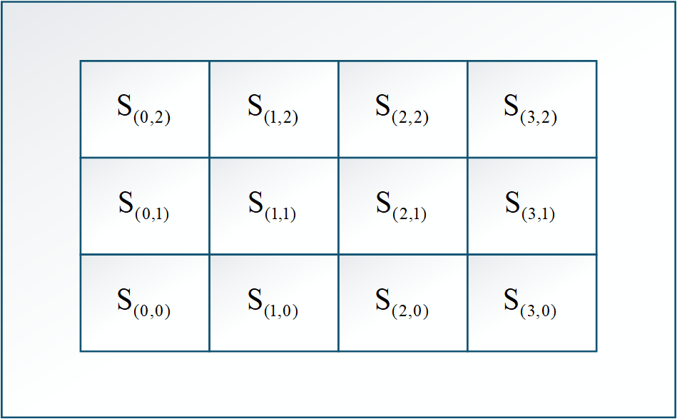

## 环境

``` bash
python=3.8.2
numpy==1.22.0
matplotlib==3.5.0
gym[classic_control]==0.23.0
Scipy==1.8.0
Pygame==2.1.2
Torch==1.8.0
```

## 非稳态 bandit 条件下，Qs 收敛证明

$$
\begin{aligned}
Q_{n} & =Q_{n-1}+\alpha_{n-1}\left[R_{n-1}-Q_{n-1}\right] \\
& =\left(1-\alpha_{n-1}\right) Q_{n-1}+\alpha_{n-1} R_{n-1} \\
& =\left(1-\alpha_{n-1}\right)\left[\left(1-\alpha_{n-2}\right) Q_{n-2}+\alpha_{n-2} R_{n-2}\right]+\alpha_{n-1} R_{n-1} \\
& =\left(1-\alpha_{n-1}\right)\left(1-\alpha_{n-2}\right) Q_{n-2}+\left(1-\alpha_{n-1}\right) \alpha_{n-2} R_{n-2}+\alpha_{n-1} R_{n-1} \\
& =\ldots \\
& =\prod_{i=1}^{n-1}\left(1-\alpha_{i}\right) Q_{1}+\sum_{i=1}^{n-1}\left[\alpha_{i} \prod_{j=i+1}^{n-1}\left(1-\alpha_{j}\right) R_{i}\right] \\
& =\sum_{i=1}^{n-1}\left[\alpha_{i} \prod_{j=i+1}^{n-1}\left(1-\alpha_{j}\right) R_{i}\right] \quad\left(\text { 设 } Q_{1}=0\right) \\
& =\sum_{i=1}^{n-1} w_{i} R_{i} \quad\left(\text { 其中 } w_{i}=\alpha_{i} \prod_{j=i+1}^{n-1}\left(1-\alpha_{j}\right)\right) \\
& =\sum_{i=1}^{n-1} w_{i}\left(Q^{*}_{i}+X_{i}\right) \quad\left(\text { 其中 } R_{i}=Q^{*}_{i}+X_{i}, Q^{*}_{i} \text{为当前环境下的期望奖励}, X_{i} \text{为零均值噪声}\right)
\end{aligned}
$$

**当 $\alpha_{n-1}=\frac{1}{n}$ 时，有：**
$$
\begin{aligned}
w_{i} & =\alpha_{i} \prod_{j=i+1}^{n-1}\left(1-\alpha_{j}\right) \\
& =\frac{1}{i+1} \prod_{j=i+1}^{n-1}\left(1-\frac{1}{j+1}\right) \\
& =\frac{1}{i+1} \prod_{j=i+1}^{n-1} \frac{j}{j+1} \\
& =\frac{1}{i+1} \cdot \frac{i+1}{n} \\
& =\frac{1}{n} \\
\\
\Rightarrow Q_{n} & =\sum_{i=1}^{n-1} \frac{1}{n}\left(Q^{*}_{i}+X_{i}\right)
\end{aligned}
$$

**当 $\alpha_{n-1}$ 为定值时，有：**
$$
\begin{aligned}
w_{i} & =\alpha_{i} \prod_{j=i+1}^{n-1}\left(1-\alpha_{j}\right) \\
& =\alpha \prod_{j=i+1}^{n-1}(1-\alpha) \\
& =\alpha(1-\alpha)^{n-1-i} \\
\\
\Rightarrow Q_{n} & =\sum_{i=1}^{n-1} \alpha(1-\alpha)^{n-1-i}\left(Q^{*}_{i}+X_{i}\right)
\end{aligned}
$$

由此可见，
- 当 $\alpha_{n-1}=\frac{1}{n}$ 时，Qs 对所有过去的奖励均等加权，适用于稳态环境下的 bandit 问题
- 当 $\alpha_{n-1}$ 为定值时，Qs 对近期奖励赋予更大权重，权重按照指数衰减，适用于非稳态环境下的 bandit 问题

## 贝尔曼方程

$$
\begin{aligned}
G_{t} & = R_{t} + \gamma R_{t+1} + \gamma^{2} R_{t+2} + \gamma^{3} R_{t+3} + \ldots \\
& = R_{t} + \gamma\left(R_{t+1} + \gamma R_{t+2} + \gamma^{2} R_{t+3} + \ldots\right) \\
& = R_{t} + \gamma G_{t+1} \\
& \text{其中} \\
& R_{t} \text{为 t 时刻的奖励} \\
& \gamma \in[0,1] \text{为折扣因子} \\
& G_{t} \text{为 t 时刻以及之后的累计折扣奖励} \\
\end{aligned}
$$

**状态价值函数的贝尔曼方程**
$$
\begin{aligned}
v_{\pi}(s) & =\mathbb{E}_{\pi}\left[G_{t} \mid S_{t}=s\right] \\
& =\mathbb{E}_{\pi}\left[R_{t}+\gamma G_{t+1} \mid S_{t}=s\right] \\
& =\mathbb{E}_{\pi}\left[R_{t} \mid S_{t}=s\right] + \gamma \mathbb{E}_{\pi}\left[G_{t+1} \mid S_{t}=s\right] \\
& \text{其中} \\
& v_{\pi}(s) \text{为策略} \pi \text{在状态 } s \text{ 下的状态价值函数} \\
\\
\mathbb{E}_{\pi}\left[R_{t} \mid S_{t}=s\right] & = \sum R(s, a, s') * P(a, s' | s, \pi) \\
& = \sum_{a} \pi(a | s) \sum_{s'} P(s' | s, a) R(s, a, s') \\
& = \sum_{a, s'} \pi(a | s) P(s' | s, a) R(s, a, s') \\
& 其中 \\
& R(s,a,s') 表示在状态 s 下采取动作 a，并转移到状态 s' 时所获得的奖励。\\
\\
\mathbb{E}_{\pi}\left[G_{t+1} \mid S_{t}=s\right] & = \sum P(a, s' | s, \pi) \mathbb{E}_{\pi}\left[G_{t+1} \mid S_{t+1}=s'\right] \\
& = \sum_{a} \pi(a | s) \sum_{s'} P(s' | s, a) v_{\pi}(s') \\
& = \sum_{a, s'} \pi(a | s) P(s' | s, a) v_{\pi}(s') \\
\\
\Rightarrow v_{\pi}(s) & = \sum_{a, s'} \pi(a | s) P(s' | s, a) \left[R(s, a, s') + \gamma v_{\pi}(s')\right]
\end{aligned}
$$

**动作价值函数的贝尔曼方程**
$$
\begin{aligned}
q_{\pi}(s, a) & =\mathbb{E}_{\pi}\left[G_{t} \mid S_{t}=s, A_{t}=a\right] \\
& =\mathbb{E}_{\pi}\left[R_{t}+\gamma G_{t+1} \mid S_{t}=s, A_{t}=a\right] \\
& =\mathbb{E}_{\pi}\left[R_{t} \mid S_{t}=s, A_{t}=a\right] + \gamma \mathbb{E}_{\pi}\left[G_{t+1} \mid S_{t}=s, A_{t}=a\right] \\
& \text{其中} \\
& q_{\pi}(s, a) \text{为策略} \pi \text{在状态 } s \text{ 下采取动作 } a \text{ 的动作价值函数} \\
\\
\mathbb{E}_{\pi}\left[R_{t} \mid S_{t}=s, A_{t}=a\right] & = \sum_{s'} P(s' | s, a) R(s, a, s') \\
& 其中 \\
& R(s,a,s') 表示在状态 s 下采取动作 a，并转移到状态 s' 时所获得的奖励。\\
\\
\mathbb{E}_{\pi}\left[G_{t+1} \mid S_{t}=s, A_{t}=a\right] & = \sum P(s' | s, a, \pi) \mathbb{E}_{\pi}\left[G_{t+1} \mid S_{t+1}=s'\right] \\
& = \sum_{s'} P(s' | s, a) v_{\pi}(s') \\
& = \sum_{s'} P(s' | s, a) \sum_{a'} \pi(a' | s') q_{\pi}(s', a') \\
\Rightarrow q_{\pi}(s, a) & = \sum_{s'} P(s' | s, a) \left[R(s, a, s') + \gamma v_{\pi}(s')\right] \\
& = \sum_{s'} P(s' | s, a) \left[R(s, a, s') + \gamma \sum_{a'} \pi(a' | s') q_{\pi}(s', a')\right]
\end{aligned}
$$

**总结**
状态价值函数描述了在给定状态下，遵循特定策略所能获得的预期回报。而动作价值函数则在此基础上对当前动作进行了条件化，描述了在特定状态下采取特定动作后，遵循该策略所能获得的预期回报。
也就是说状态价值函数描述的是在给定状态下，全局动作域中所有动作的期望回报，而动作价值函数则具体到某一个动作的期望回报。
所以 **状态价值函数 = 动作价值函数 在 全局动作域 上的加权平均，权重即为策略在该状态下选择各动作的概率分布**。

## 动态规划法求解状态价值函数的贝尔曼方程收敛性和唯一性证明

**状态价值函数的贝尔曼方程**
$$
\begin{aligned}
G_{t} & = R_{t} + \gamma G_{t+1} \\
v_{\pi}(s) & =\mathbb{E}_{\pi}\left[G_{t} \mid S_{t}=s\right] \\
& =\mathbb{E}_{\pi}\left[R_{t}+\gamma G_{t+1} \mid S_{t}=s\right] \\
& =\mathbb{E}_{\pi}\left[R_{t} \mid S_{t}=s\right] + \gamma \mathbb{E}_{\pi}\left[G_{t+1} \mid S_{t}=s\right] \\
& = \sum_{a, s'} \pi(a | s) P(s' | s, a) \left[R(s, a, s') + \gamma v_{\pi}(s')\right]
\end{aligned}
$$

**状态转移表达式**
$$
\begin{aligned}
v_{k+1}(s) & = \sum_{a, s'} \pi(a | s) P(s' | s, a) \left[R(s, a, s') + \gamma v_{k}(s')\right]
\end{aligned}
$$

**收敛性证明**
$$
\begin{aligned}
\|v_{k+1} - v_{\pi}\|_{\infty} & = \max_{s} |v_{k+1}(s) - v_{\pi}(s)| \\
& = \max_{s} \left| \sum_{a, s'} \pi(a | s) P(s' | s, a) \left[R(s, a, s') + \gamma v_{k}(s')\right] - \sum_{a, s'} \pi(a | s) P(s' | s, a) \left[R(s, a, s') + \gamma v_{\pi}(s')\right] \right| \\
& = \max_{s} \left| \sum_{a, s'} \pi(a | s) P(s' | s, a) \gamma \left[v_{k}(s') - v_{\pi}(s')\right] \right| \\
& \leq \max_{s} \sum_{a, s'} \pi(a | s) P(s' | s, a) \gamma \left|v_{k}(s') - v_{\pi}(s')\right| \\
& \leq \max_{s} \sum_{a, s'} \left[ \pi(a | s) P(s' | s, a) (\gamma \max_{s'} \left|v_{k}(s') - v_{\pi}(s')\right|) \right] \\
& = (\gamma \max_{s'} \left|v_{k}(s') - v_{\pi}(s')\right|) \max_{s} \sum_{a, s'} \pi(a | s) P(s' | s, a) \\
& = \gamma \max_{s'} \left|v_{k}(s') - v_{\pi}(s')\right| \\
& = \gamma \|v_{k} - v_{\pi}\|_{\infty} \\
\\
\Rightarrow \|v_{k+1} - v_{\pi}\|_{\infty} & \leq \gamma^{k+1} \|v_{0} - v_{\pi}\|_{\infty} \\
& \text{由于 } 0 \leq \gamma < 1, \text{ 当 } k \to \infty, \gamma^{k+1} \to 0 \\
& \Rightarrow \lim_{k \to \infty} \|v_{k+1} - v_{\pi}\|_{\infty} = 0 \\
& \Rightarrow \lim_{k \to \infty} v_{k}(s) = v_{\pi}(s)
\end{aligned}
$$

**唯一性证明**
$$
\begin{aligned}
& \text{假设存在两个不同的状态价值函数 } v_{\pi} \text{ 和 } u_{\pi}, \text{ 满足贝尔曼方程} \\
v_{\pi}(s) & = \sum_{a, s'} \pi(a | s) P(s' | s, a) \left[R(s, a, s') + \gamma v_{\pi}(s')\right] \\
u_{\pi}(s) & = \sum_{a, s'} \pi(a | s) P(s' | s, a) \left[R(s, a, s') + \gamma u_{\pi}(s')\right] \\
\\
\Rightarrow \|v_{\pi} - u_{\pi}\|_{\infty} & = \max_{s} |v_{\pi}(s) - u_{\pi}(s)| \\
& = \max_{s} \left| \sum_{a, s'} \pi(a | s) P(s' | s, a) \left[R(s, a, s') + \gamma v_{\pi}(s')\right] - \sum_{a, s'} \pi(a | s) P(s' | s, a) \left[R(s, a, s') + \gamma u_{\pi}(s')\right] \right| \\
& = \max_{s} \left| \sum_{a, s'} \pi(a | s) P(s' | s, a) \gamma \left[v_{\pi}(s') - u_{\pi}(s')\right] \right| \\
& \leq \max_{s} \sum_{a, s'} \pi(a | s) P(s' | s, a) \gamma \left|v_{\pi}(s') - u_{\pi}(s')\right| \\
& \leq \max_{s} \sum_{a, s'} \left[ \pi(a | s) P(s' | s, a) (\gamma \max_{s'} \left|v_{\pi}(s') - u_{\pi}(s')\right|) \right] \\
& = (\gamma \max_{s'} \left|v_{\pi}(s') - u_{\pi}(s')\right|) \max_{s} \sum_{a, s'} \pi(a | s) P(s' | s, a) \\
& = \gamma \max_{s'} \left|v_{\pi}(s') - u_{\pi}(s')\right| \\
& = \gamma \|v_{\pi} - u_{\pi}\|_{\infty} \\
\\
\Rightarrow \|v_{\pi} - u_{\pi}\|_{\infty} & \leq \gamma \|v_{\pi} - u_{\pi}\|_{\infty} \\
& \text{由于 } 0 \leq \gamma < 1, \text{ 仅当 } \|v_{\pi} - u_{\pi}\|_{\infty} = 0 \text{ 时不等式成立} \\
& \Rightarrow v_{\pi}(s) = u_{\pi}(s) \text{ 对所有状态 } s \text{ 成立}
\end{aligned}
$$

## 蒙特卡罗方法求解状态价值函数的贝尔曼方程

**状态地图**


**状态价值评估过程**
$$
\begin{aligned}
& \text{蒙特卡洛回合采样 } = \left[(S_{0}, A_{0}, R_{0}), (S_{1}, A_{1}, R_{1}), ..., (S_{t}, A_{t}, R_{t}) \right] \\
& \text{初始化状态价值函数 } V(s) = 0, \text{ 访问计数器 } N(s) = 0, \text{ 对所有状态 } s \in S \\
& G_{S_{t}} = 0，\text{终点的累计折扣奖励为0 } \\
& \text{对于每个时间步 } T \text{ 从 } t-1 \text{ 到 } 0: \\
& \quad G_{S_{T}} = R_{T} + \gamma G_{S_{T+1}} \\
& \quad N(S_{T}) = N(S_{T}) + 1 \\
& \quad V(S_{T}) = V(S_{T}) + \frac{1}{N(S_{T})} \left[G_{S_{T}} - V(S_{T+1})\right] \\
& \text{返回更新后的状态价值函数 } V(s) \text{ 对所有状态 } s \in S
\end{aligned}
$$

**说明**
- 蒙特卡洛方法通过多次采样完整的回合数据，利用实际获得的奖励序列来估计状态价值函数。
- 这种方法不依赖于环境的动态模型，而是通过实际经验进行学习，适用于模型未知或复杂的环境。
- 在每个回合结束后，算法会从回合的最后一个时间步开始，反向计算每个状态的累计折扣奖励 G，并更新对应状态的价值估计 V(s)。
- 从最后一个时间步开始计算，逐步向前更新，可以利用$ V_{S_{T}} $的更新公式特性减少重复计算从而加速计算。

## 蒙特卡罗方法求解动作价值函数的贝尔曼方程

**状态地图**


**动作价值评估过程**
$$
\begin{aligned}
& \text{蒙特卡洛回合采样 } = \left[(S_{0}, A_{0}, R_{0}), (S_{1}, A_{1}, R_{1}), ..., (S_{t}, A_{t}, R_{t}) \right] \\
& \text{初始化动作价值函数 } Q(s, a) = 0, \text{ 访问计数器 } N(s, a) = 0, \text{ 对所有状态-动作对 } (s, a) \in S \times A \\
& G_{S_{t}, A_{t}} = 0，\text{终点的累计折扣奖励为0 } \\
& \text{对于每个时间步 } T \text{ 从 } t-1 \text{ 到 } 0: \\
& \quad G_{S_{T}, A_{T}} = R_{T} + \gamma G_{S_{T+1}, A_{T+1}} \\
& \quad N(S_{T}, A_{T}) = N(S_{T}, A_{T}) + 1 \\
& \quad Q(S_{T}, A_{T}) = Q(S_{T}, A_{T}) + \frac{1}{N(S_{T}, A_{T})} \left[G_{S_{T}, A_{T}} - Q(S_{T+1}, A_{T+1})\right] \\
& \text{返回更新后的动作价值函数 } Q(s, a) \text{ 对所有状态-动作对 } (s, a) \in S \times A
\end{aligned}
$$

**说明**
- 因为策略是动态变化并且贪婪的，所以有可能某些状态-动作对在采样过程中从未被选择过，导致这些对的价值无法更新，也有可能导致死循环。
- 为了解决这些问题，可以采用探索策略（如 ε-贪婪策略）来确保所有状态-动作对都有机会被选择和更新。

## dp -> mc -> td -> sarsa

**基本公式**

$$
\begin{aligned}
\text{回报定义： } \\
G_{t} &= R_{t} + \gamma R_{t+1} + \gamma^2 R_{t+2} + ... \\
G_{t} &= R_{t} + \gamma G_{t+1} \\
\text{状态价值函数(状态回报)： } \\
v_{\pi}(s) &= \sum_{a, s'} \pi(a|s) \cdot P(s'|s, a) \cdot [R(s, a, s') + \gamma v_{\pi}(s')] \\
\text{动作价值函数（动作回报）： } \\
q_{\pi}(s, a) &= \sum_{s'} P(s'|s, a) \cdot [R(s, a, s') + \gamma v_{\pi}(s')] \\
&= \sum_{s'} P(s'|s, a) \cdot [R(s, a, s') + \gamma \sum_{a'} \pi(a'|s') \cdot q_{\pi}(s', a')] \\
\text{最优策略： } \\
\pi_{*}(s) &= \argmax_{a} q_{*}(s, a) \\
&= \argmax_{a} \sum_{s'} P(s'|s, a) \cdot [R(s, a, s') + \gamma v_{*}(s')]
\end{aligned}
$$

**价值函数之间的关系**

$$
\begin{aligned}
v_{\pi}(s) \Leftrightarrow q_{\pi}(s, a) \\
v_{\pi}(s) \Rightarrow \pi_{*}(s) \\
q_{\pi}(s, a) \Rightarrow \pi_{*}(s)
\end{aligned}
$$

### dp

**dp 状态价值迭代**

$$
\begin{aligned}
V_{t+1}(s) &= \max_{a} \sum_{s'} P(s'|s, a)\,[R(s, a, s') + \gamma V_{t}(s')]
\end{aligned}
$$

``` python
def value_iter_oneEpoch(env, V, gamma):
    new_V = {}
    for state in env.states():
        actions_value = []
        for action in env.actions():
            next_state, reward = env.step(state, action)
            actions_value.append(reward + gamma * V[next_state])
        new_V[state] = max(actions_value)
    return new_V
```

**dp 策略评估**

$$
\begin{aligned}
V_{t+1}(s) &= \sum_{a, s'} \pi(a|s)\, P(s'|s, a)\,[R(s, a, s') + \gamma V_{t}(s')]
\end{aligned}
$$

``` python
def policy_eval_oneEpoch(env, V, policy, gamma):
    new_V = {}
    for state in env.states():
        actions_value = []
        for action in env.actions():
            next_state, reward = env.step(state, action)
            actions_value.append((reward + gamma * V[next_state]) * policy[state][action])
        new_V[state] = sum(actions_value)
    return new_V
```

**dp 策略改进**

$$
\begin{aligned}
\pi_{*}(s) &= \argmax_{a} \sum_{s'} P(s'|s, a)\,[R(s, a, s') + \gamma V_{t}(s')]
\end{aligned}
$$

``` python
def policy_improve(env, V, gamma):
    policy = {}
    for state in env.states():
        actions_value = {}
        for action in env.actions():
            next_state, reward = env.step(state, action)
            actions_value[action] = reward + gamma * V[next_state]
        max_action = max(actions_value, key=actions_value.get)
        policy[state] = {a: 1.0 if a == max_action else 0.0 for a in env.actions()}
    return policy
```

**tips**
- 价值迭代是策略评估的一个特例：当策略为 $\pi(a|s)=1$（仅在 $a$ 为动作价值最大的动作时），策略评估方程退化为价值迭代(价值迭代 = 完全贪婪策略 + 策略评估)。
- 状态价值迭代的结束标志是 $max|V_{t+1}(s)-V_{t}(s)| < \epsilon$。
- dp 方法需要完整的环境动态模型，适用于小规模、可建模的环境。

### mc

**mc 状态价值迭代**

$$
\begin{aligned}
memory &= [(s_{0}, a_{0}, r_{0}), (s_{1}, a_{1}, r_{1}), ..., (s_{t}, a_{t}, r_{t})], \text{memory 为回合采样数据, 其中} s_{t} \text{为终止状态, 所以} G_{s_{t}} = 0 \\
G_{t-1} &= r_{t-1} + \gamma G_{t} \\
V_{t-1}(s) &+= \alpha [G_{s_{t-1}} - V_{t-1}(s)]
\end{aligned}
$$

``` python
def stateValue_eval(V, alpha=0.1, gamma=0.9, memory):
    G_s = 0
    for state, action, reward in reversed(memory):
        G_s = reward + gamma * G_s
        V[state] += (G_s - V[state]) * alpha
    return V
```

**mc 动作价值迭代**

$$
\begin{aligned}
memory &= [(s_{0}, a_{0}, r_{0}), (s_{1}, a_{1}, r_{1}), ..., (s_{t}, a_{t}, r_{t})], \text{memory 为回合采样数据, 其中} s_{t} \text{为终止状态, 所以} G_{s_{t}, a_{t}} = 0 \\
G_{t-1} &= r_{t-1} + \gamma G_{t} \\
Q_{t-1}(s, a) &+= \alpha [G_{s_{t-1}, a_{t-1}} - Q_{t-1}(s, a)]
\end{aligned}
$$

``` python
def actionValue_eval(Q, alpha=0.1, gamma=0.9, memory):
    G_sa = 0
    for state, action, reward in reversed(memory):
        G_sa = reward + gamma * G_sa
        Q[state][action] += (G_sa - Q[state][action]) * alpha
    return Q
```

**mc 策略生成**
``` python
def policy_generate(Q, epsilon=0.1):
    policy = {}
    for state in Q.keys():
        actions_value = Q[state]
        max_action = max(actions_value, key=actions_value.get)
        policy[state] = {}
        for action in actions_value.keys():
            if action == max_action:
                policy[state][action] = 1 - epsilon + (epsilon / len(actions_value))
            else:
                policy[state][action] = epsilon / len(actions_value)
    return policy
```

**tips**
- mc 方法需要完整的回合采样数据，适用于回合制任务。
- 状态价值评估和动作价值评估的更新仅**依赖于同一回合中的真实采样**，不依赖于环境的动态模型。

### td

**td 状态价值迭代**

$$
\begin{aligned}
memory &= [(s_{0}, a_{0}, r_{0}), (s_{1}, a_{1}, r_{1}), ..., (s_{t}, a_{t}, r_{t})], \text{memory 为回合采样数据, } s_{t} \text{不要求是终止状态, } V_{t} 初始化为 0 \\
V_{t-1}(s) &+= \alpha [r + \gamma V_{t-1}(s') - V_{t-1}(s)]
\end{aligned}
$$

``` python
def stateValue_eval(V, alpha=0.1, gamma=0.9, state, action, reward, next_state):
    next_V = V[next_state] if next_state in V else 0
    V[state] += (reward + gamma * next_V - V[state]) * alpha
    return V
```

**td 动作价值迭代**

$$
\begin{aligned}
memory &= [(s_{0}, a_{0}, r_{0}), (s_{1}, a_{1}, r_{1}), ..., (s_{t}, a_{t}, r_{t})], \text{memory 为回合采样数据, } s_{t} \text{不要求是终止状态, } Q_{t} 初始化为 0 \\
Q_{t-1}(s, a) &+= \alpha [r + \gamma Q_{t-1}(s', a') - Q_{t-1}(s, a)]
\end{aligned}
$$

``` python
def actionValue_eval(Q, alpha=0.1, gamma=0.9, state, action, reward, next_state, next_action):
    next_Q = Q[next_state][next_action] if next_state in Q and next_action in Q[next_state] else 0
    Q[state][action] += (reward + gamma * next_Q - Q[state][action]) * alpha
    return Q
```

**td 策略生成**

``` python
def policy_generate(Q, epsilon=0.1):
    policy = {}
    for state in Q.keys():
        actions_value = Q[state]
        max_action = max(actions_value, key=actions_value.get)
        policy[state] = {}
        for action in actions_value.keys():
            if action == max_action:
                policy[state][action] = 1 - epsilon + (epsilon / len(actions_value))
            else:
                policy[state][action] = epsilon / len(actions_value)
    return policy
```

**tips**
- td 方法不要求完整的回合数据，可以在每个时间步进行更新，适用于连续任务。
- 状态价值评估和动作价值评估的更新**依赖于跨回合的真实采样**，不依赖于环境的动态模型。

### sarsa

sarsa 是 td 方法的一种实现

$$
\begin{aligned}
memory\_deque &= [(s, a, r, s', a')], \text{memory\_deque 为固定长度的采样数据队列, } s' \text{不要求是终止状态, } Q_{t} 初始化为 0 \\
Q_{t-1}(s, a) &+= \alpha [r + \gamma Q_{t-1}(s', a') - Q_{t-1}(s, a)]
\end{aligned}
$$

``` python
def sarsa_actionValue_eval(Q, alpha=0.1, gamma=0.9, memory_deque):
    for state, action, reward, next_state, next_action in memory_deque:
        next_Q = Q[next_state][next_action] if next_state in Q and next_action in Q[next_state] else 0
        Q[state][action] += (reward + gamma * next_Q - Q[state][action]) * alpha
    return Q
```

这是修改后的完整版本，既保持了你原有的教学说明风格，又让实现逻辑符合强化学习理论中 **同策略（SARSA）** 与 **异策略（Q-learning）** 的核心差异。

---

## 同策略学习 vs. 异策略学习

同策略方法（On-policy methods）和异策略方法（Off-policy methods）是强化学习中的两种不同学习策略。

* **同策略方法（On-policy）**：在实际行动中采用的策略（actionPolicy）与学习更新的策略（targetPolicy）相同，例如 SARSA。
* **异策略方法（Off-policy）**：行为策略与目标策略不同，例如 Q-learning；重要性采样和max算子是实现异策略学习的两种常用方法。

## 概率模型 vs. 样本模型

概率模型是显式的保存策略的概率分布，使用时直接根据概率分布进行采样选择动作。
样本模型是显式的保存策略的采样数据，使用时通过采样数据进行估计选择动作。