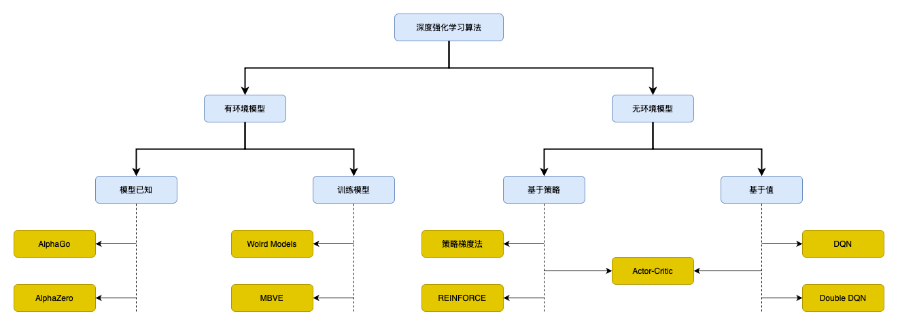

## 深度强化学习算法分类



### MCTS Pipeline

环境配置
```bash
uv venv --python 3.9

source .venv/bin/activate

uv sync
```

训练
```bash
python -u -m expand.pipeline > train.log
```

人机对战
```bash
python -m expand.MCTS_Gomoku_NeuralNet_GUI
```