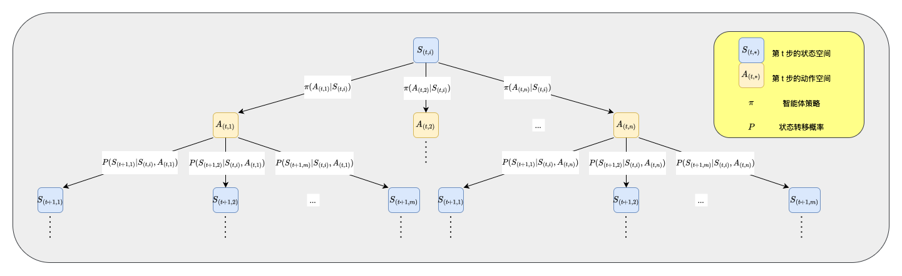
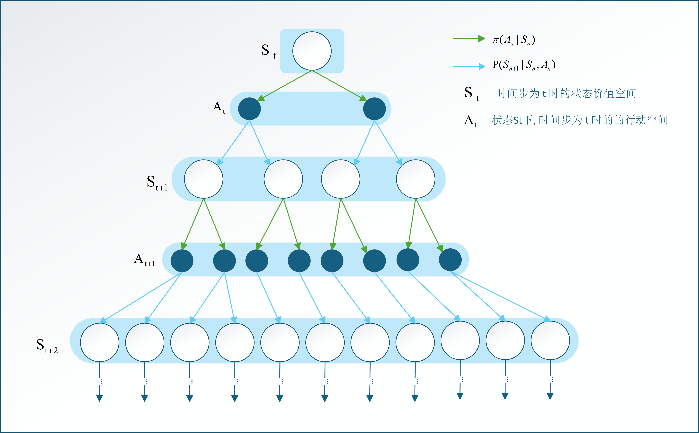
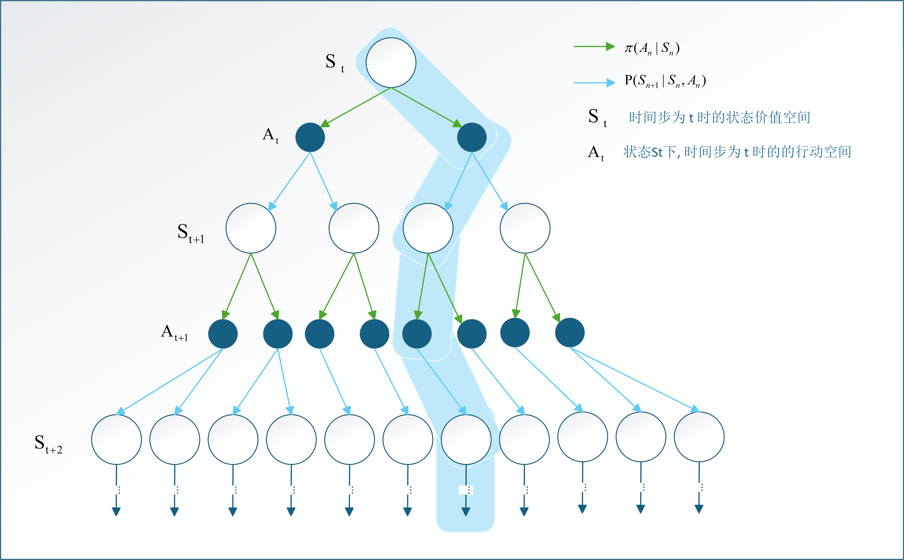
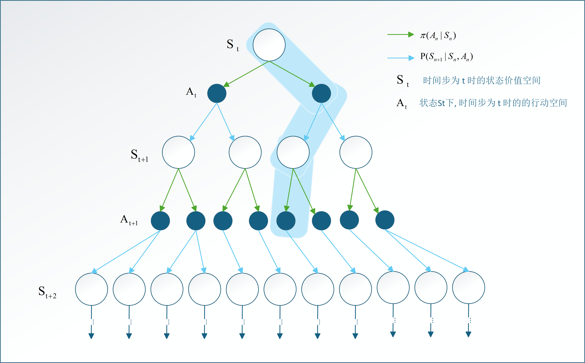

# 深度学习入门 4(1.1 -> 10.2) 总结

## 稳态/非稳态 bandit 问题
场景：有 k 臂老虎机，每次选择一个臂拉动，获得奖励。目标是最大化总奖励。
- 稳态 bandit 问题：每个臂的奖励分布不变。
- 非稳态 bandit 问题：每个臂的奖励分布随时间或者环境变化。

假设当前对多笔老虎机的了解如下：
| 臂 | 平均奖励估计值$Q_{n}$ | 被选择次数$n$ |
|----|----------------|------------|
| 1  | 1.2            | 10         |
| 2  | 0.8            | 5          |
| 3  | 1.5            | 8          |
| 4  | 1.0            | 12         |

在稳态场景下，单个臂的多个选择结果都是对同一奖励分布的采样，因此每个选择对奖励分布的刻画具有同等的价值。
$$
\begin{aligned}
Q_{n + 1} &= \frac{R_{1} + R_{2} + \cdots + R_{n + 1}}{n + 1} \\
&= \frac{Q_{n} \cdot n + R_{n + 1}}{n + 1} \\
&= \frac{Q_{n} \cdot (n + 1 - 1) + R_{n + 1}}{n + 1} \\
&= \frac{Q_{n} \cdot (n + 1) + R_{n + 1} - Q_{n}}{n + 1} \\
&= Q_{n} + \frac{1}{n + 1} \left[ R_{n + 1} - Q_{n} \right]
\end{aligned}
$$

而在非稳态场景下，单个臂的多个选择结果可能对应不同的奖励分布，最近的选择结果对奖励分布的刻画更有价值。因此，我们引入一个常数步长参数 $\alpha$，对每次选择的奖励进行加权平均：
$$
\begin{aligned}
Q_{0} &= 0 \\
Q_{1} &= \alpha R_{1} + (1 - \alpha)Q_{0} \\
Q_{2} &= \alpha R_{2} + (1 - \alpha)Q_{1} \\
... \\
Q_{n + 1} &= \alpha R_{n + 1} + (1 - \alpha)Q_{n} \\
&= Q_{n} + \alpha \left[ R_{n + 1} - Q_{n} \right]
\end{aligned}
$$
其中，$0 < \alpha \leq 1$。较小的 $\alpha$ 表示更重视历史奖励，适合稳态环境，较大的 $\alpha$ 表示更重视最新的奖励，适合非稳态环境。

## 马尔可夫决策过程 (Markov Decision Process, MDP)
MDP 是强化学习中用于描述环境与智能体交互的数学框架。一个 MDP 通常由以下几个要素组成：

1. **状态空间 (State Space, S)**：表示环境可能处于的所有状态的集合。每个状态 $s \in S$ 描述了环境在某一时刻的具体情况。

2. **动作空间 (Action Space, A)**：表示智能体可以执行的所有动作的集合。每个动作 $a \in A$ 是智能体在某一状态下可以选择的行为。

3. **状态转移概率 (State Transition Probability, P)**：描述在给定当前状态 $s$ 和动作 $a$ 下，转移到下一个状态 $s'$ 的概率。通常表示为 $P(s'|s, a)$。

4. **奖励函数 (Reward Function, R)**：定义在状态 $s$ 下执行动作 $a$ 后，智能体获得的即时奖励。 通常表示为 $R(s, a)$。

5. **折扣因子 (Discount Factor, γ)**：一个介于 0 和 1 之间的数值，用于衡量未来奖励的重要性。较高的折扣因子表示智能体更重视未来的奖励。



6. **马尔可夫性质**
MDP 假设环境满足马尔可夫性质，即当前状态包含了所有必要的信息来预测未来状态和奖励。换句话说，给定当前状态 $s_t$ 和动作 $a_t$，未来状态 $s_{t+1}$ 和奖励 $r_{t+1}$ 的分布仅依赖于 $s_t$ 和 $a_t$，而与过去的状态和动作无关。
$$
P(s_{t+1}, r_{t+1} | s_t, a_t) = P(s_{t+1}, r_{t+1} | s_0, a_0, s_1, a_1, ..., s_t, a_t)
$$

## 状态价值函数与动作价值函数

1. **智能体策略**
策略 (Policy, π) 是智能体在每个状态下选择动作的规则或函数。策略可以是确定性的，也可以是随机的。
- 确定性策略 (Deterministic Policy)：在每个状态下，策略明确指定一个动作，即 $a = π(s)$。
- 随机策略 (Stochastic Policy)：在每个状态下，策略给出一个动作的概率分布，即 $π(a|s)$，表示在状态 $s$ 下选择动作 $a$ 的概率。

2. **回报 (Return, $G_t$)**：表示从时间步 $t$ 开始，未来所有奖励的折扣累计和。数学表达式为：
$$
G_{t} = \sum_{k=0}^{\infty} \gamma^{k} r_{t+k}
$$

3. **状态价值函数 (State Value Function, $v^{\pi}(s)$)**：表示在状态 $s$ 下，按照策略 $π$ 行动时，预期的回报。数学表达式为：
$$
v^{\pi}(s) = \mathbb{E}_{\pi} [G_{t} | s_{t} = s]
$$

4. **动作价值函数 (Action Value Function, $q^{\pi}(s, a)$)**：表示在状态 $s$ 下，执行动作 $a$ 并随后按照策略 $π$ 行动时，预期的回报。数学表达式为：
$$
q^{\pi}(s, a) = \mathbb{E}_{\pi} [G_{t} | s_{t} = s, a_{t} = a]
$$

5. **状态价值函数与动作价值函数的关系**：
$$
v^{\pi}(s) = \sum_{a} \pi(a|s) q^{\pi}(s, a)
$$

6. **最优策略**
最优策略 (Optimal Policy, $π^*$) 是指在所有可能的策略中，能够最大化预期回报的策略。对于任意状态 $s$，，最优策略满足：
$$
π^{*} = \arg\max_{\pi} v^{\pi}(s)
$$

7. **最优状态价值函数 (Optimal State Value Function, $v^{*}(s)$)**：表示在状态 $s$ 下，按照最优策略 $π^*$ 行动时，预期的最大回报。数学表达式为：
$$
v^{*}(s) = \max_{\pi} v^{\pi}(s)
$$
8. **最优动作价值函数 (Optimal Action Value Function, $q^{*}(s, a)$)**：表示在状态 $s$ 下，执行动作 $a$ 并随后按照最优策略 $π^*$ 行动时，预期的最大回报。数学表达式为：
$$
q^{*}(s, a) = \max_{\pi} q^{\pi}(s, a)
$$
9. **最优状态价值函数与最优动作价值函数的关系**：
$$
\begin{aligned}
v^{*}(s) &= \max_{a} q^{*}(s, a) \\
q^{*}(s, a) &= R(s, a) + \gamma \sum_{s'} P(s'|s, a) v^{*}(s')
\end{aligned}
$$

## 贝尔曼方程
贝尔曼方程 (Bellman Equation) 是描述状态价值函数和动作价值函数之间关系的递归方程。它们是强化学习中求解最优策略和价值函数的基础。

1. **状态值函数的贝尔曼方程**
对于给定策略 $π$，状态价值函数 $v^{\pi}(s)$ 满足以下贝尔曼方程：
$$
\begin{aligned}
v^{\pi}(s) &= \mathbb{E}_{\pi} [G_{t} | s_{t} = s] \\
&= \mathbb{E}_{\pi} [r_{t} + \gamma G_{t+1} | s_{t} = s] \\
&= \mathbb{E}_{\pi} [r_{t} | s_{t} = s] + \gamma \mathbb{E}_{\pi} [G_{t+1} | s_{t} = s] \\
&= \sum_{a} \pi(a | s) \sum_{s'} P(s' | s, a) \left[ R(s, a, s') + \gamma v^{\pi}(s') \right]
\end{aligned}
$$

2. **动作值函数的贝尔曼方程**
对于给定策略 $π$，动作价值函数 $q^{\pi}(s, a)$ 满足以下贝尔曼方程：
$$
\begin{aligned}
q^{\pi}(s, a) &= \mathbb{E}_{\pi} [G_{t} | s_{t} = s, a_{t} = a] \\
&= \mathbb{E}_{\pi} [r_{t} + \gamma G_{t+1} | s_{t} = s, a_{t} = a] \\
&= \mathbb{E}_{\pi} [r_{t} | s_{t} = s, a_{t} = a] + \gamma \mathbb{E}_{\pi} [G_{t+1} | s_{t} = s, a_{t} = a] \\
&= \sum_{s'} P(s' | s, a) \left[ R(s, a, s') + \gamma v^{\pi}(s') \right] \\
&= \sum_{s'} P(s' | s, a) \left[ R(s, a, s') + \gamma \sum_{a'} \pi(a' | s') q^{\pi}(s', a') \right]
\end{aligned}
$$

3. **最优状态值函数的贝尔曼方程**
最优状态价值函数 $v^{*}(s)$ 满足以下贝尔曼方程：
$$
\begin{aligned}
v^{*}(s) &= \max_{a} \sum_{s'} P(s' | s, a) \left[ R(s, a, s') + \gamma v^{*}(s') \right] \\
&= \max_{a} \sum_{s'} P(s' | s, a) \left[ R(s, a, s') + \gamma \max_{a'} q^{*}(s', a') \right]
\end{aligned}
$$

4. **最优动作值函数的贝尔曼方程**
最优动作价值函数 $q^{*}(s, a)$ 满足以下贝尔曼方程：
$$
\begin{aligned}
q^{*}(s, a) &= \sum_{s'} P(s' | s, a) \left[ R(s, a, s') + \gamma \max_{a'} q^{*}(s', a') \right] \\
&= \sum_{s'} P(s' | s, a) \left[ R(s, a, s') + \gamma v^{*}(s') \right]
\end{aligned}
$$

## 动态规划方法
动态规划 (Dynamic Programming, DP) 是一种用于求解最优策略和价值函数的算法。它基于贝尔曼方程，通过迭代更新价值函数和策略来逐步逼近最优解。**动态规划方法通常假设环境的模型已知**。



1. **基于状态价值的策略评估 (Policy Evaluation)**：给定一个策略 $π$，通过迭代更新状态价值函数 $v^{\pi}(s)$ 来评估该策略的性能。更新公式为：
$$
v_{k+1}^{\pi}(s) = \sum_{a} \pi(a | s) \sum_{s'} P(s' | s, a) \left[ R(s, a, s') + \gamma v_{k}^{\pi}(s') \right]
$$
``` python
pi = {...}  # 给定策略
P = ...  # 状态转移概率函数
R = ...  # 奖励函数
v = {s: 0 for s in S}  # 初始化状态价值函数
theta = 1e-6  # 收敛阈值
while True:
    delta = 0
    for s in S:
        v_old = v[s]
        v_new = 0
        for a in A:
            for s_ in S_:
                v_new += pi[a][s] * P[s][a][s_] * (R[s][a][s_] + gamma * v[s_])
        delta = max(delta, abs(v_old - v_new))
        v[s] = v_new
    if delta < theta:
        break
```

2. **基于动作价值的策略评估 (Policy Evaluation)**：给定一个策略 $π$，通过迭代更新动作价值函数 $q^{\pi}(s, a)$ 来评估该策略的性能。更新公式为：
$$
q_{k+1}^{\pi}(s, a) = \sum_{s'} P(s' | s, a) \left[ R(s, a, s') + \gamma \sum_{a'} \pi(a' | s') q_{k}^{\pi}(s', a') \right]
$$
``` python
pi = {...}  # 给定策略
P = ...  # 状态转移概率函数
R = ...  # 奖励函数
q = {(s, a): 0 for s in S for a in A}  # 初始化动作价值函数
theta = 1e-6  # 收敛阈值
while True:
    delta = 0
    for s in S:
        for a in A:
            q_old = q[(s, a)]
            q_new = 0
            for s_ in S_:
                exp_next = 0
                for a_ in A_:
                    exp_next += pi[a_][s_] * q[(s_, a_)]
                q_new += P[s][a][s_] * (R[s][a][s_] + gamma * exp_next)
            delta = max(delta, abs(q_old - q_new))
            q[(s, a)] = q_new
    if delta < theta:
        break
```

3. **基于状态价值的策略改进 (Policy Improvement)**：通过更新策略 $π$ 来提升其性能。对于每个状态 $s$，选择使动作价值函数最大的动作作为新的策略：
$$
\pi'(s) = \arg\max_{a} \sum_{s'} P(s'|s,a) [R(s,a,s') + \gamma v^{\pi}(s')]
$$
``` python
v = {...}  # 已评估的状态价值函数
P = ...  # 状态转移概率函数
R = ...  # 奖励函数
pi = {}  # 初始化策略
for s in S:
    best_a = None
    best_value = float('-inf')
    for a in A:
        q_value = 0
        for s_ in S_:
            q_value += P[s][a][s_] * (R[s][a][s_] + gamma * v[s_])
        if q_value > best_value:
            best_value = q_value
            best_a = a
    pi[s] = best_a
```

4. **基于动作价值的策略改进 (Policy Improvement)**：通过更新策略 $π$ 来提升其性能。对于每个状态 $s$，选择使动作价值函数最大的动作作为新的策略：
$$
\pi'(s) = \arg\max_{a} q^{\pi}(s, a)
$$
``` python
q = {...}  # 已评估的动作价值函数
pi = {}  # 初始化策略
for s in S:
    best_a = None
    best_value = float('-inf')
    for a in A:
        if q[(s, a)] > best_value:
            best_value = q[(s, a)]
            best_a = a
    pi[s] = best_a
```

5. **基于状态价值与动作价值的对比**

| 对比项      | 基于状态价值 $ v^{\pi}(s) $                                                                     | 基于动作价值 $ q^{\pi}(s, a) $                                                                      |
| :------- | :---------------------------------------------------------------------------------------- | :-------------------------------------------------------------------------------------------- |
| **评估阶段** | 更新只需 $ v(s) $，递推简单：<br>$ v(s)=\sum_a \pi(a\mid s)\sum_{s'}P(s'\mid s,a)[R+\gamma v(s')] $ | 更新需计算所有后续动作期望：<br>$ q(s,a)=\sum_{s'}P(s'\mid s,a)[R+\gamma \sum_{a'}\pi(a'\mid s')q(s',a')] $ |
| **改进阶段** | 要通过 $ v(s) $ 间接推导最优动作：<br>$ \pi'(s)=\arg\max_a\sum_{s'}P(s'\mid s,a)[R+\gamma v(s')] $    | 直接选最大动作：<br>$ \pi'(s)=\arg\max_a q(s,a) $                                                     |
| **思路特征** | “先评估，再推动作”                                                                                | “直接在动作层面评估”                                                                                   |
| **典型算法** | Policy Iteration（策略迭代）                                                                    | Q Iteration / Q-learning（动作价值迭代）                                                              |
| **计算代价** | 每次迭代需遍历所有 ( s,a,s' )                                                                      | 每次迭代需遍历所有 ( s,a,s',a' )                                                                       |
| **可扩展性** | 适合模型已知（动态规划）                                                                              | 更适合模型未知（强化学习）                                                                                 |

6. **基于状态价值的DP方法的收敛性与唯一性证明**
假设状态空间为有限集合 $S$，动作空间为有限集合 $A$，状态转移概率固定为 $P$，折扣因子为 $0 \leq \gamma < 1$，策略固定为 $\pi$。定义状态价值函数的更新算子 $T^{\pi}$：
$$
(T^{\pi} v)(s) = \sum_{a} \pi(a | s) \sum_{s'} P(s' | s, a) \left[ R(s, a, s') + \gamma v(s') \right]
$$
对于任意两个状态价值函数 $v$ 和 $v'$，有：
$$
\begin{aligned}
\| T^{\pi} v - T^{\pi} v' \|_{\infty} &= \max_{s} | (T^{\pi} v)(s) - (T^{\pi} v')(s) | \\
&= \max_{s} \left| \sum_{a} \pi(a | s) \sum_{s'} P(s' | s, a) \gamma [v(s') - v'(s')] \right| \\
&\leq \gamma \max_{s} | v(s) - v'(s) | \\
&= \gamma \| v - v' \|_{\infty}
\end{aligned}$$
由于 $0 \leq \gamma < 1$，更新算子 $T^{\pi}$ 是一个压缩映射。根据压缩映射原理，状态价值函数的迭代更新将收敛到唯一的不动点，即策略 $π$ 的状态价值函数 $v^{\pi}$。

7. **基于动作价值的DP方法的收敛性与唯一性证明**
假设状态空间为有限集合 $S$，动作空间为有限集合 $A$，状态转移概率固定为 $P$，折扣因子为 $0 \leq \gamma < 1$，策略固定为 $\pi$。定义动作价值函数的更新算子 $T^{\pi}$：
$$
(T^{\pi} q)(s, a) = \sum_{s'} P(s' | s, a) \left[ R(s, a, s') + \gamma \sum_{a'} \pi(a' | s') q(s', a') \right]
$$
对于任意两个动作价值函数 $q$ 和 $q'$，有：
$$
\begin{aligned}
\| T^{\pi} q - T^{\pi} q' \|_{\infty} &= \max_{s, a} | (T^{\pi} q)(s, a) - (T^{\pi} q')(s, a) | \\
&= \max_{s, a} \left| \sum_{s'} P(s' | s, a) \gamma \sum_{a'} \pi(a' | s') [q(s', a') - q'(s', a')] \right| \\
&\leq \gamma \max_{s, a} | q(s, a) - q'(s, a) | \\
&= \gamma \| q - q' \|_{\infty}
\end{aligned}$$
由于 $0 \leq \gamma < 1$，更新算子 $T^{\pi}$ 是一个压缩映射。根据压缩映射原理，动作价值函数的迭代更新将收敛到唯一的不动点，即策略 $π$ 的动作价值函数 $q^{\pi}$。

## 蒙特卡罗方法
蒙特卡罗方法 (Monte Carlo Methods) 是一种基于采样的强化学习算法，用于估计状态价值函数和动作价值函数。它通过多次与环境交互，**收集完整的回合经验数据**，并利用这些数据来更新价值函数和策略。**蒙特卡罗方法不需要环境的模型信息，适用于模型未知的情况。**



1. **基于状态价值的策略评估 (Policy Evaluation)**：通过多次采样轨迹，计算每个状态的平均回报来估计状态价值函数 $v^{\pi}(s)$。更新公式为：
$$
v^{\pi}(s) = \frac{1}{N(s)} \sum_{i=1}^{N(s)} G_{t_i}
$$
其中，$N(s)$ 是状态 $s$ 被访问的次数，$G_{t_i}$ 是第 $i$ 次访问状态 $s$ 时的回报。
``` python
# every-visit 方法
pi = {...}  # 给定策略
episodes = [...]  # 多次采样的轨迹数据
v = {s: 0 for s in S}  # 初始化状态价值函数
N = {s: 0 for s in S}  # 状态访问次数
for episode in episodes:
    G = 0
    for s, a, r in reversed(episode):
        G = r + gamma * G
        N[s] += 1
        v[s] += (G - v[s]) / N[s]  # 增量更新

# first-visit 方法
pi = {...}  # 给定策略
episodes = [...]  # 多次采样的轨迹数据
v = {s: 0 for s in S}  # 初始化状态价值函数
N = {s: 0 for s in S}  # 状态访问次数
for episode in episodes:
    G = 0
    visited = set()  # 记录已访问状态
    for s, a, r in reversed(episode):
        G = r + gamma * G
        if s not in visited:
            visited.add(s)
            N[s] += 1
            v[s] += (G - v[s]) / N[s]  # 增量更新
```

2. **基于动作价值的策略评估 (Policy Evaluation)**：通过多次采样轨迹，计算每个状态-动作对的平均回报来估计动作价值函数 $q^{\pi}(s, a)$。更新公式为：
$$
q^{\pi}(s, a) = \frac{1}{N(s, a)} \sum_{i=1}^{N(s, a)} G_{t_i}
$$
其中，$N(s, a)$ 是状态-动作对 $(s, a)$ 被访问的次数，$G_{t_i}$ 是第 $i$ 次访问状态-动作对 $(s, a)$ 时的回报。
``` python
# every-visit 方法
pi = {...}  # 给定策略
episodes = [...]  # 多次采样的轨迹数据
q = {(s, a): 0 for s in S for a in A}  # 初始化动作价值函数
N = {(s, a): 0 for s in S for a in A}  # 状态-动作对访问次数
for episode in episodes:
    G = 0
    for s, a, r in reversed(episode):
        G = r + gamma * G
        N[(s, a)] += 1
        q[(s, a)] += (G - q[(s, a)]) / N[(s, a)]  # 增量更新

# first-visit 方法
pi = {...}  # 给定策略
episodes = [...]  # 多次采样的轨迹数据
q = {(s, a): 0 for s in S for a in A}  # 初始化动作价值函数
N = {(s, a): 0 for s in S for a in A}  # 状态-动作对访问次数
for episode in episodes:
    G = 0
    visited = set()  # 记录已访问状态-动作对
    for s, a, r in reversed(episode):
        G = r + gamma * G
        if (s, a) not in visited:
            visited.add((s, a))
            N[(s, a)] += 1
            q[(s, a)] += (G - q[(s, a)]) / N[(s, a)]  # 增量更新
```

3. **基于状态价值的策略改进 (Policy Improvement)**：基于状态价值的策略改进依赖于环境的奖励函数R(s, a, s')，由于mc方法假设环境未知，没有直接可用的奖励函数，所以无法直接基于状态价值进行策略改进。
$$
\pi'(s) = \arg\max_{a} \sum_{s'} P(s'|s,a) [R(s,a,s') + \gamma v^{\pi}(s')]
$$

4. **基于动作价值的策略改进 (Policy Improvement)**：通过更新策略 $π$ 来提升其性能。对于每个状态 $s$，选择使动作价值函数最大的动作作为新的策略：
$$
\pi'(s) = \arg\max_{a} q^{\pi}(s, a)
$$
``` python
q = {...}  # 已评估的动作价值函数
pi = {}  # 初始化策略
for s in S:
    best_a = None
    best_value = float('-inf')
    for a in A:
        if q[(s, a)] > best_value:
            best_value = q[(s, a)]
            best_a = a
    pi[s] = best_a
```

5. **增量的选择**
在蒙特卡罗方法中，增量更新是一种在线更新价值函数的方法。每次访问状态或状态-动作对时，根据当前的回报 $G$ 和之前的估计值进行更新，更新公式为：
$$
\begin{aligned}
V_{n+1}(s) &= V_{n}(s) + \frac{1}{n + 1} (G(s) - V_{n}(s)) \\
Q_{n+1}(s, a) &= Q_{n}(s, a) + \frac{1}{n + 1} (G(s, a) - Q_{n}(s, a))
\end{aligned}
$$

其中，$n$ 是状态 $s$ 或状态-动作对 $(s, a)$ 被访问的次数，适用于稳态环境。为了适应非稳态环境，可以引入常数步长参数 $\alpha$，$0 < \alpha \leq 1$， $\alpha$ 越大越重视近期奖励，越小越重视历史奖励，更新公式变为：

$$
\begin{aligned}
V_{n+1}(s) &= V_{n}(s) + \alpha (G(s) - V_{n}(s)) \\
Q_{n+1}(s, a) &= Q_{n}(s, a) + \alpha (G(s, a) - Q_{n}(s, a))
\end{aligned}
$$

## 同策略型和异策略型

1. **同策略型 (On-policy)**：行为生成的策略和评估/改进的策略相同。

2. **异策略型 (Off-policy)**：行为生成的策略和评估/改进的策略不同。

## 时序差分学习
时序差分学习(Temporal Difference Learning, TD Learning) 是一种结合了蒙特卡罗方法和动态规划方法优点的强化学习算法。它通过在每个时间步更新价值函数来实现在线学习，而不需要等待整个回合结束。TD Learning 适用于模型未知的环境，并且能够处理非稳态环境。



1. **基于状态价值的策略评估 (Policy Evaluation)**：通过在每个时间步更新状态价值函数 $v^{\pi}(s)$ 来评估策略 $\pi$ 的性能。更新公式为：
$$
v(s) \leftarrow v(s) + \alpha [r + \gamma v(s') - v(s)]
$$
``` python
pi = {...}  # 给定策略
episodes = [...]  # 多次采样的轨迹数据
v = {s: 0 for s in S}  # 初始化状态价值函数
alpha = 0.1  # 学习率
for episode in episodes:
    for s, a, r, s_ in episode:
        v[s] += alpha * (r + gamma * v[s_] - v[s])
```

2. **基于动作价值的策略评估 (Policy Evaluation)**：通过在每个时间步更新动作价值函数 $q^{\pi}(s, a)$ 来评估策略 $\pi$ 的性能。更新公式为：
$$
q(s, a) \leftarrow q(s, a) + \alpha [r + \gamma q(s', a') - q(s, a)]
$$
``` python
pi = {...}  # 给定策略
episodes = [...]  # 多次采样的轨迹数据
q = {(s, a): 0 for s in S for a in A}  # 初始化动作价值函数
alpha = 0.1  # 学习率
for episode in episodes:
    for s, a, r, s_, a_ in episode:
        q[(s, a)] += alpha * (r + gamma * q[(s_, a_)] - q[(s, a)])
```

3. **基于状态价值的策略改进 (Policy Improvement)**：基于状态价值的策略改进依赖于环境的奖励函数R(s, a, s')，由于TD方法假设环境未知，没有直接可用的奖励函数，所以无法直接基于状态价值进行策略改进。
$$
\pi'(s) = \arg\max_{a} \sum_{s'} P(s'|s,a) [R(s,a,s') + \gamma v^{\pi}(s')]
$$

4. **基于动作价值的策略改进 (Policy Improvement)**：通过更新策略 $π$ 来提升其性能。对于每个状态 $s$，选择使动作价值函数最大的动作作为新的策略：
$$
\pi'(s) = \arg\max_{a} q^{\pi}(s, a)
$$
``` python
q = {...}  # 已评估的动作价值函数
pi = {}  # 初始化策略
for s in S:
    best_a = None
    best_value = float('-inf')
    for a in A:
        if q[(s, a)] > best_value:
            best_value = q[(s, a)]
            best_a = a
    pi[s] = best_a
```

5. **同策略型 SARSA**：在同策略型 SARSA 中，智能体按照当前策略选择动作，并使用该动作的价值来更新动作价值函数。更新公式为：
$$
q(s, a) \leftarrow q(s, a) + \alpha [r + \gamma q(s', a') - q(s, a)]
$$
``` python
pi = {...}  # 给定策略
episodes = [...]  # 多次采样的轨迹数据
q = {(s, a): 0 for s in S for a in A}  # 初始化动作价值函数
alpha = 0.1  # 学习率
for episode in episodes:
    for s, a, r, s_, a_ in episode:
        q[(s, a)] += alpha * (r + gamma * q[(s_, a_)] - q[(s, a)])
```

6. **异策略型 Q-learning**：在异策略型 Q-learning 中，智能体可以按照一个行为策略选择动作，但使用最优动作的价值来更新动作价值函数。更新公式为：
$$
q(s, a) \leftarrow q(s, a) + \alpha [r + \gamma \max_{a'} q(s', a') - q(s, a)]
$$
``` python
episodes = [...]  # 多次采样的轨迹数据
q = {(s, a): 0 for s in S for a in A}  # 初始化动作价值函数
alpha = 0.1  # 学习率
for episode in episodes:
    for s, a, r, s_ in episode:
        max_q_next = max(q[(s_, a_)] for a_ in A)
        q[(s, a)] += alpha * (r + gamma * max_q_next - q[(s, a)])
```

7. **蒙特卡罗方法与时序差分学习的对比**

| 对比项      | 蒙特卡罗方法 (Monte Carlo Methods)                                                                 | 时序差分学习 (Temporal Difference Learning, TD Learning)                                                   |
| :------- | :---------------------------------------------------------------------------------------- | :-------------------------------------------------------------------------------------------- |
| **更新时机** | 在每个回合结束后更新价值函数                                                                 | 在每个时间步更新价值函数                                                                                   |
| **依赖信息** | 需要完整的回合数据来计算回报 $G$，适用于模型未知的环境                                                                 | 只需要当前状态、动作、奖励和下一个状态的信息，适用于模型未知的环境                                                                                   |
| **收敛性** | 在每个状态被访问无限次的情况下，蒙特卡罗方法的估计将收敛到真实的状态价值函数 $v^{\pi}(s)$ 或动作价值函数 $q^{\pi}(s, a)$                                                                 | 在每个状态被访问无限次的情况下，TD 学习的估计将收敛到真实的状态价值函数 $v^{\pi}(s)$ 或动作价值函数 $q^{\pi}(s, a)$                                                                                   |
| **偏差** | 由于使用完整回合数据，蒙特卡罗方法的估计通常是无偏的                                                                 | 由于使用单步更新，TD 学习的估计可能具有偏差，特别是在初始阶段                                                                                   |
| **计算效率** | 需要等待整个回合结束才能更新价值函数，可能导致较慢的学习速度                                                                 | 可以在每个时间步更新价值函数，通常具有更快的学习速度                                                                                   |
| **典型算法** | Monte Carlo Policy Evaluation, Monte Carlo Control                                                                 | SARSA (同策略型), Q-learning (异策略型)                                                                                   |

## DQN(Deep Q-Network)
DQN 是一种结合了深度学习和强化学习的算法，用于解决高维状态空间中的强化学习问题。DQN 使用深度神经网络来近似动作价值函数 $q(s, a)$，并通过经验回放和目标网络等技术来稳定训练过程。

1. **经验回放 (Experience Replay)**：DQN 使用一个经验回放缓冲区（replay buffer）来存储智能体与环境交互的经验数据 ((s,a,r,s'))。在训练过程中，智能体从缓冲区中随机采样一批经验用于更新神经网络参数。这种做法能够打破样本之间的时序相关性，提高数据利用率和训练稳定性。然而，在**非稳态环境**中，缓冲区中的旧经验可能与当前**奖励分布**不一致，从而引入训练偏差。

2. **目标网络 (Target Network)**：DQN 引入了一个目标网络，用于计算目标 Q 值。目标网络的参数定期从主网络复制过来，保持一段时间不变。这种做法能够减少训练过程中的震荡和发散现象，提高训练的稳定性。在**非稳态环境**中，目标网络的更新频率需要根据环境变化进行调整，以确保目标 Q 值的准确性。

3. **损失函数 (Loss Function)**：DQN 使用均方误差 (Mean Squared Error, MSE) 作为损失函数，衡量当前 Q 值与目标 Q 值之间的差距。目标 Q 值的计算方式为：
$$
y = r + \gamma \max_{a'} Q_{\text{target}}(s', a')
$$
损失函数的表达式为：
$$
L(\theta) = \mathbb{E}_{(s,a,r,s') \sim \text{replay buffer}} \left[ \left( y - Q(s, a; \theta) \right)^2 \right]
$$

4. **训练过程 (Training Process)**：DQN 的训练过程包括以下步骤：
    - 初始化主网络和目标网络的参数 $\theta$ 和 $\theta^-$。
    - 初始化经验回放缓冲区。
    - 在每个时间步，智能体根据当前策略选择动作 $a$，执行动作并观察奖励 $r$ 和下一个状态 $s'$。
    - 将经验 (s, a, r, s') 存储到经验回放缓冲区中。
    - 从经验回放缓冲区中随机采样一批经验，计算目标 Q 值并更新主网络的参数 $\theta$。
    - 定期将主网络的参数复制到目标网络 $\theta^- \leftarrow \theta$。
``` python
import numpy as np
import random
import torch
import torch.nn as nn
import torch.optim as optim

class DQN(nn.Module):
    def __init__(self, state_dim, action_dim):
        super(DQN, self).__init__()
        self.fc1 = nn.Linear(state_dim, 128)
        self.fc2 = nn.Linear(128, 128)
        self.fc3 = nn.Linear(128, action_dim)

    def forward(self, x):
        x = torch.relu(self.fc1(x))
        x = torch.relu(self.fc2(x))
        return self.fc3(x)

class ReplayBuffer:
    def __init__(self, capacity):
        self.buffer = []
        self.capacity = capacity
        self.position = 0
    def push(self, state, action, reward, next_state):
        if len(self.buffer) < self.capacity:
            self.buffer.append(None)
        self.buffer[self.position] = (state, action, reward, next_state)
        self.position = (self.position + 1) % self.capacity
    def sample(self, batch_size):
        return random.sample(self.buffer, batch_size)
    def __len__(self):
        return len(self.buffer)

class DQNAgent:
    def __init__(self, state_dim, action_dim):
        self.action_dim = action_dim
        self.policy_net = DQN(state_dim, action_dim)
        self.target_net = DQN(state_dim, action_dim)
        self.target_net.load_state_dict(self.policy_net.state_dict())
        self.target_net.eval()
        self.optimizer = optim.Adam(self.policy_net.parameters(), lr=1e-3)
        self.replay_buffer = ReplayBuffer(10000)
        self.gamma = 0.99
        self.batch_size = 64
        self.update_target_steps = 1000
        self.steps_done = 0

    def select_action(self, state, epsilon):
        if random.random() < epsilon:
            return random.randrange(self.action_dim)
        with torch.no_grad():
            return self.policy_net(torch.FloatTensor(state)).argmax().item()

    def update(self):
        if len(self.replay_buffer) < self.batch_size:
            return
        batch = self.replay_buffer.sample(self.batch_size)
        states, actions, rewards, next_states = zip(*batch)
        states = torch.FloatTensor(states)
        actions = torch.LongTensor(actions).unsqueeze(1)
        rewards = torch.FloatTensor(rewards).unsqueeze(1)
        next_states = torch.FloatTensor(next_states)

        current_q_values = self.policy_net(states).gather(1, actions)
        next_q_values = self.target_net(next_states).max(1)[0].unsqueeze(1)
        target_q_values = rewards + (self.gamma * next_q_values)

        loss = nn.MSELoss()(current_q_values, target_q_values)

        self.optimizer.zero_grad()
        loss.backward()
        self.optimizer.step()

        if self.steps_done % self.update_target_steps == 0:
            self.target_net.load_state_dict(self.policy_net.state_dict())
        self.steps_done += 1
```

5. **DQN 的改进版本**：为了进一步提升 DQN 的性能，研究者们提出了多种改进版本，如 Double DQN、Dueling DQN 和 Prioritized Experience Replay 等。这些改进版本通过引入新的机制来减少过估计偏差、提高学习效率和稳定性，从而在各种强化学习任务中取得了更好的表现。

## 策略梯度方法 (Policy Gradient Methods)
策略梯度方法是一类直接优化策略参数的强化学习算法。与基于价值函数的方法不同，策略梯度方法通过最大化预期回报来直接更新策略参数。

1. **策略参数化 (Policy Parameterization)**：在策略梯度方法中，策略 $π$ 通常被参数化为一个函数 $π_{\theta}(a | s)$，其中 $\theta$ 是策略的参数。常见的参数化方法包括线性函数、神经网络等。

2. **策略梯度定理 (Policy Gradient Theorem)**：策略梯度定理提供了一个计算策略梯度的公式，使得我们可以直接优化策略参数。策略梯度定理的表达式为：
$$
\nabla_{\theta} J(\theta) = \mathbb{E}_{\pi_{\theta}} \left[ \nabla_{\theta} \log \pi_{\theta}(a | s) G(\tau) \right]
$$
其中，$J(\theta)$ 是策略的性能指标，$G(\tau)$ 是回报函数，$\tau$ 是一个轨迹。

3. **策略梯度定理证明**：
$$
\begin{aligned}
& \text{轨迹：} \tau = \big((s_{0},a_{0},r_{0}),(s_{1},a_{1},r_{1}),\dots,(s_{T},a_{T},r_{T})\big), \text{其中} r_{T}=0, s_{T} \text{为轨迹终点} \\
& \text{轨迹从时间 t 开始的回报：}G_{t} = \sum_{k=0}^{T-t} \gamma^{k} r_{t+k} \\
& \text{轨迹概率：} P_{\theta}(\tau) = P(s_{0}) \prod_{t=0}^{T-1} \pi_{\theta}(a_{t} | s_{t}) P(s_{t+1} | s_{t}, a_{t}) \\
& \text{目标函数(期望回报)：} J(\theta) = \mathbb{E}_{\tau\sim\pi_{\theta}} [G_{0}] = \sum_{\tau} P_{\theta}(\tau) G_{0}(\tau)
\end{aligned}
$$

目标函数关于策略参数 $\theta$ 的梯度为：
$$
\begin{aligned}
\nabla_{\theta} J(\theta) &= \nabla_{\theta} \sum_{\tau} P_{\theta}(\tau) G_{0}(\tau) \\
&= \sum_{\tau} \nabla_{\theta} P_{\theta}(\tau) G_{0}(\tau) \\
&= \sum_{\tau} P_{\theta}(\tau) \frac{\nabla_{\theta} P_{\theta}(\tau)}{P_{\theta}(\tau)} G_{0}(\tau) \\
&= \sum_{\tau} P_{\theta}(\tau) \nabla_{\theta} \log P_{\theta}(\tau) G_{0}(\tau) \\
&= \mathbb{E}_{\tau\sim\pi_{\theta}} \left[ \nabla_{\theta} \log P_{\theta}(\tau) G_{0}(\tau) \right]
\end{aligned}
$$

轨迹概率的对数梯度为：
$$
\begin{aligned}
\nabla_{\theta} \log P_{\theta}(\tau) &= \nabla_{\theta} \log \left( P(s_{0}) \prod_{t=0}^{T-1} \pi_{\theta}(a_{t} | s_{t}) P(s_{t+1} | s_{t}, a_{t}) \right) \\
&= \nabla_{\theta} \left( \log P(s_{0}) + \sum_{t=0}^{T-1} \log \pi_{\theta}(a_{t} | s_{t}) + \sum_{t=0}^{T-1} \log P(s_{t+1} | s_{t}, a_{t}) \right) \\
&= \sum_{t=0}^{T-1} \nabla_{\theta} \log \pi_{\theta}(a_{t} | s_{t})
\end{aligned}
$$

将轨迹概率的对数梯度代入目标函数的梯度表达式中，得到策略梯度定理：
$$
\nabla_{\theta} J(\theta) = \mathbb{E}_{\tau\sim\pi_{\theta}} \left[ \sum_{t=0}^{T-1} \nabla_{\theta} \log \pi_{\theta}(a_{t} | s_{t}) G_{0} \right]
$$

用样本平均进行估计(N 条轨迹)，得到策略梯度的近似表达式：
$$
\nabla_{\theta} J(\theta) \approx \frac{1}{N} \sum_{i=1}^{N} \sum_{t=0}^{T-1} \nabla_{\theta} \log \pi_{\theta}(a_{t}^{(i)} | s_{t}^{(i)}) G_{0}^{(i)}
$$

对应的参数更新公式为：
$$
\theta \leftarrow \theta + \alpha \nabla_{\theta} J(\theta)
$$

4. **损失函数构造**：在策略梯度方法中，损失函数通常被定义为负的目标函数，以便通过最小化损失函数来最大化目标函数。损失函数的表达式为：
$$
L(\theta) = -J(\theta) = -\mathbb{E}_{\tau\sim\pi_{\theta}} \left[ \nabla_{\theta} \log \pi_{\theta}(a | s) G(\tau) \right]
$$

使用样本平均进行估计(N 条轨迹)，得到损失函数的近似表达式：
$$
L(\theta) \approx -\frac{1}{N} \sum_{i=1}^{N} \sum_{t=0}^{T-1} \nabla_{\theta} \log \pi_{\theta}(a_{t}^{(i)} | s_{t}^{(i)}) G_{0}^{(i)}
$$

5. **带基函数的策略梯度证明**
假设我们引入一个基函数 $b(s)$，新的目标函数为：
$$
J(\theta) = \mathbb{E}_{\tau\sim\pi_{\theta}} \left[ \sum_{t=0}^{T-1} \nabla_{\theta} \log \pi_{\theta}(a_{t} | s_{t}) (G_{0} - b(s_{t})) \right]
$$

根据策略梯度定理，我们可以证明引入基函数不会改变策略梯度的期望值。具体证明如下：
$$
\begin{aligned}
& \mathbb{E}_{\tau\sim\pi_{\theta}} \left[ \sum_{t=0}^{T-1} \nabla_{\theta} \log \pi_{\theta}(a_{t} | s_{t}) b(s_{t}) \right] \\
&= \sum_{\tau} P_{\theta}(\tau) \sum_{t=0}^{T-1} \nabla_{\theta} \log \pi_{\theta}(a_{t} | s_{t}) b(s_{t}) \\
&= \sum_{t=0}^{T-1} \sum_{s_{t}} b(s_{t}) \sum_{a_{t}} \nabla_{\theta} \pi_{\theta}(a_{t} | s_{t}) \sum_{\tau_{-t}} P_{\theta}(\tau_{-t} | s_{t}, a_{t}) \\
&= \sum_{t=0}^{T-1} \sum_{s_{t}} b(s_{t}) \sum_{a_{t}} \nabla_{\theta} \pi_{\theta}(a_{t} | s_{t}) \cdot 1 \\
&= \sum_{t=0}^{T-1} \sum_{s_{t}} b(s_{t}) \nabla_{\theta} \left( \sum_{a_{t}} \pi_{\theta}(a_{t} | s_{t}) \right) \\
&= \sum_{t=0}^{T-1} \sum_{s_{t}} b(s_{t}) \nabla_{\theta} (1) \\
&= 0
\end{aligned}
$$
因此，带基函数的策略梯度的期望值与不带基函数的策略梯度相同.

6. **策略梯度方法**：
目标函数统一表示为：
$$
J(\theta) = \mathbb{E}_{\tau\sim\pi_{\theta}} \left[ \sum_{t=0}^{T-1} \nabla_{\theta} \log \pi_{\theta}(a_{t} | s_{t}) \delta_{t} \right]
$$

其中，$\delta_{t}$ 可以表示为不同的回报估计方式：
* **基础形式（完整轨迹回报）**：
  $$
  \delta_t = G_{\tau}
  $$
  表示整条轨迹的总回报，用于理论推导或全回报估计。

* **蒙特卡罗回报（MC return）**：
  $$
  \delta_t = G_t = \sum_{k=t}^{T} \gamma^{k-t} r_k
  $$
  直接使用从时间步 (t) 开始到终止的折扣累计回报。

* **带基线的蒙特卡罗回报（MC with baseline）**：
  $$
  \delta_t = G_t - b(s_t)
  $$
  通过引入基线函数 $b(s_t)$ 来降低估计方差（通常取 $b(s_t)=v(s_t)$）。

* **时序差分误差（TD error）**：
  $$
  \delta_t = r_t + \gamma v(s_{t+1}) - v(s_t)
  $$
  使用一步时序差分估计未来回报。

* **优势函数（Advantage function）**：
  $$
  \delta_t = Q(s_t,a_t) - v(s_t)
  $$
  表示动作相对于平均状态价值的优势程度。

7. **Actor-Critic 方法**：
Actor-Critic 方法是一种结合了策略梯度方法和基于价值函数方法的强化学习算法。它由两个主要组件组成：Actor（策略网络）和 Critic（价值网络）。Actor 负责选择动作，而 Critic 负责评估 Actor 的动作选择。Actor-Critic 方法通过 Critic 的评估来指导 Actor 的更新，从而实现更高效的学习。
``` python
class ActorCritic(nn.Module):
    def __init__(self, state_dim, action_dim):
        super(ActorCritic, self).__init__()
        self.actor = nn.Sequential(
            nn.Linear(state_dim, 128),
            nn.ReLU(),
            nn.Linear(128, action_dim),
            nn.Softmax(dim=-1)
        )
        self.critic = nn.Sequential(
            nn.Linear(state_dim, 128),
            nn.ReLU(),
            nn.Linear(128, 1)
        )
    def forward(self, state):
        action_probs = self.actor(state)
        state_value = self.critic(state)
        return action_probs, state_value

class ActorCriticAgent:
    def __init__(self, state_dim, action_dim):
        self.model = ActorCritic(state_dim, action_dim)
        self.optimizer = optim.Adam(self.model.parameters(), lr=1e-3)
        self.gamma = 0.99
    def select_action(self, state):
        action_probs, _ = self.model(torch.FloatTensor(state))
        action = torch.multinomial(action_probs, 1).item()
        return action
    def update(self, state, action, reward, next_state):
        action_probs, state_value = self.model(torch.FloatTensor(state))
        _, next_state_value = self.model(torch.FloatTensor(next_state))
        td_error = reward + self.gamma * next_state_value - state_value
        actor_loss = -torch.log(action_probs[action]) * td_error.detach()
        critic_loss = td_error.pow(2)
        loss = actor_loss + critic_loss
        self.optimizer.zero_grad()
        loss.backward()
        self.optimizer.step()
```

8. **TRPO 方法(原理比较复杂，有时间再研究)**：
TRPO (Trust Region Policy Optimization) 是一种基于策略梯度的强化学习算法，旨在通过限制每次更新的步长来提高训练的稳定性和效率。TRPO 通过引入一个信赖域（trust region）来确保每次的策略更新都是单调提升的。
TRPO 的核心思想是通过优化一个代理目标函数来更新策略参数，同时约束更新的幅度。代理目标函数的表达式为：
$$
L(\theta) = \mathbb{E}_{s \sim \rho_{\pi_{\theta_{\text{old}}}}, a \sim \pi_{\theta_{\text{old}}}} \left[ \frac{\pi_{\theta}(a | s)}{\pi_{\theta_{\text{old}}}(a | s)} A^{\pi_{\theta_{\text{old}}}}(s, a) \right]
$$
其中，$A^{\pi_{\theta_{\text{old}}}}(s, a)$ 是优势函数，$\rho_{\pi_{\theta_{\text{old}}}}$ 是旧策略 $\pi_{\theta_{\text{old}}}$ 生成的状态分布。TRPO 通过约束 KL 散度来限制策略更新的幅度，确保每次更新都在信赖域内，从而提高训练的稳定性和效率。

1. **PPO 方法(与 TRPO 类似，是其简化版本)**：
PPO (Proximal Policy Optimization) 是一种基于策略梯度的强化学习算法，旨在通过引入一个剪切函数来限制每次更新的幅度，从而提高训练的稳定性和效率。PPO 通过优化一个代理目标函数来更新策略参数，同时约束更新的幅度。代理目标函数的表达式为：
$$
L(\theta) = \mathbb{E}_{s \sim \rho_{\pi_{\theta_{\text{old}}}}, a \sim \pi_{\theta_{\text{old}}}} \left[ \min\left( r(\theta) A^{\pi_{\theta_{\text{old}}}}(s, a), \text{clip}(r(\theta), 1 - \epsilon, 1 + \epsilon) A^{\pi_{\theta_{\text{old}}}}(s, a) \right) \right]
$$
其中，$r(\theta) = \frac{\pi_{\theta}(a | s)}{\pi_{\theta_{\text{old}}}(a | s)}$ 是概率比，$\epsilon$ 是一个超参数，用于控制剪切范围。PPO 通过引入剪切函数来限制策略更新的幅度，确保每次更新都在一个合理的范围内，从而提高训练的稳定性和效率。

## DDPG 方法
DDPG (Deep Deterministic Policy Gradient) 是一种基于策略梯度的强化学习算法，适用于连续动作空间的任务。DDPG 结合了 DQN 的经验回放和目标网络技术，同时引入了一个**确定性策略网络**来直接输出动作。
``` python
class DDPGActor(nn.Module):
    def __init__(self, state_dim, action_dim):
        super(DDPGActor, self).__init__()
        self.fc1 = nn.Linear(state_dim, 128)
        self.fc2 = nn.Linear(128, 128)
        self.fc3 = nn.Linear(128, action_dim)
    def forward(self, x):
        x = torch.relu(self.fc1(x))
        x = torch.relu(self.fc2(x))
        return torch.tanh(self.fc3(x))

class DDPGCritic(nn.Module):
    def __init__(self, state_dim, action_dim):
        super(DDPGCritic, self).__init__()
        self.fc1 = nn.Linear(state_dim + action_dim, 128)
        self.fc2 = nn.Linear(128, 128)
        self.fc3 = nn.Linear(128, 1)
    def forward(self, state, action):
        x = torch.cat([state, action], dim=1)
        x = torch.relu(self.fc1(x))
        x = torch.relu(self.fc2(x))
        return self.fc3(x)

class DDPGAgent:
    def __init__(self, state_dim, action_dim):
        self.actor = DDPGActor(state_dim, action_dim)
        self.critic = DDPGCritic(state_dim, action_dim)
        self.target_actor = DDPGActor(state_dim, action_dim)
        self.target_critic = DDPGCritic(state_dim, action_dim)
        self.target_actor.load_state_dict(self.actor.state_dict())
        self.target_critic.load_state_dict(self.critic.state_dict())
        self.actor_optimizer = optim.Adam(self.actor.parameters(), lr=1e-4)
        self.critic_optimizer = optim.Adam(self.critic.parameters(), lr=1e-3)
        self.replay_buffer = ReplayBuffer(1000000)
        self.gamma = 0.99
        self.tau = 0.001
    def select_action(self, state):
        with torch.no_grad():
            return self.actor(torch.FloatTensor(state)).cpu().numpy()
    def update(self):
        if len(self.replay_buffer) < self.batch_size:
            return
        batch = self.replay_buffer.sample(self.batch_size)
        states, actions, rewards, next_states = zip(*batch)
        states = torch.FloatTensor(states)
        actions = torch.FloatTensor(actions)
        rewards = torch.FloatTensor(rewards).unsqueeze(1)
        next_states = torch.FloatTensor(next_states)
        # 更新 Critic
        next_actions = self.target_actor(next_states)
        target_q_values = rewards + self.gamma * self.target_critic(next_states, next_actions)
        current_q_values = self.critic(states, actions)
        critic_loss = nn.MSELoss()(current_q_values, target_q_values.detach())
        self.critic_optimizer.zero_grad()
        critic_loss.backward()
        self.critic_optimizer.step()
        # 更新 Actor
        actor_loss = -self.critic(states, self.actor(states)).mean()
        self.actor_optimizer.zero_grad()
        actor_loss.backward()
        self.actor_optimizer.step()
        # 更新目标网络
        for target_param, param in zip(self.target_actor.parameters(), self.actor.parameters()):
            target_param.data.copy_(self.tau * param.data + (1 - self.tau) * target_param.data))
        for target_param, param in zip(self.target_critic.parameters(), self.critic.parameters()):
            target_param.data.copy_(self.tau * param.data + (1 - self.tau) * target_param.data))
```